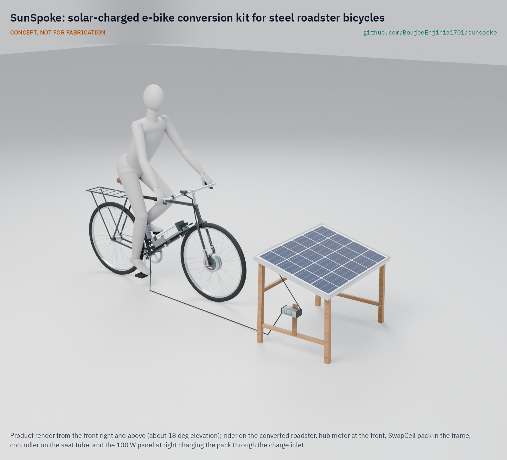
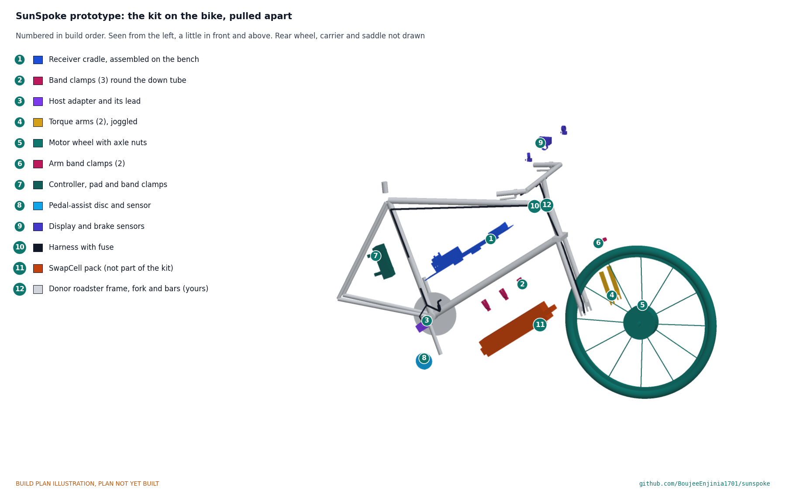

# SunSpoke

     

**Area:** Mobility and Logistics · **TRL:** 3 of 9 (proof of concept on paper) · **Value-engineering target:** USD 250 for the bike kit (estimated USD 196; solar set costed separately; pack priced in SwapCell) · **Difficulty:** 3 of 5

Open, bolt-on electric conversion kit for existing steel bicycles, serviceable by local bike mechanics and charged from a single 100 W solar panel or a shared village hub, using a SwapCell-compatible battery.

[Exploded render](media/render-exploded.png) · [Detail render](media/render-detail.png) · [Interactive 3D model](media/viewer.html) · [Concept blueprint (PDF)](media/concept-blueprint.pdf) · [General arrangement SSP-DWG-001 (PDF)](cad/drawings/SSP-DWG-001.pdf) · [Sizing note SSP-CAL-001](docs/04-calcs/01-sizing.md) · [Prototype build plan](docs/05-build-plan.md) · [Design decisions](docs/06-design-decisions.md) · [Review note](docs/REVIEW.md)

## Concept rationale

The cheapest vehicle a rural household can electrify is the one it already owns. A bolt-on front hub kit leaves the roadster's chain, rear brake and carrier untouched, so the bicycle keeps working as a bicycle if anything electrical fails, and the parts that do fail are generic e-bike parts that a roadside mechanic can swap with spanners and a multimeter. Charging from one 100 W panel, or by swapping a shared SwapCell pack at a village hub, removes the dependence on a grid that many riders do not have.

Keeping the design open matters for the same reason. Closed kits lock the local mechanic out of repairs and settings; published drawings, a priced bill of materials and a plain wiring scheme let a workshop fit, service and adapt the kit, and let a small fabricator make the cradle and panel stand locally. Every part is chosen so the conversion can be done in a garage with hand tools and no welding.

## Burning platform

In 2023, 666 million people still had no access to electricity, and 85 percent of them, about 566 million, lived in sub-Saharan Africa ([World Bank, Tracking SDG 7: The Energy Progress Report 2025](https://www.worldbank.org/en/news/press-release/2025/06/25/energy-access-has-improved-yet-international-financial-support-still-needed-to-boost-progress-and-address-disparities)). Eighteen of the 20 countries with the largest access deficits are in that region. These are the same places where the unpowered steel roadster is the working vehicle for carrying people, water and produce over dirt roads.

For these riders, an e-bike that must be charged from a wall socket is not an option, and a new e-bike costs far more than the bicycle they already have. Assist that runs on a small solar panel and fits the existing bicycle turns hours of pushing a loaded bike uphill into a ride, without waiting for the grid to arrive.

## Where it could be used

### By industry

| Industry | Use |
| --- | --- |
| Smallholder agriculture | Carrying produce, feed and water from farm to market on loaded roadsters |
| Community health services | Longer, more reliable daily rounds for health workers on rural routes |
| Informal transport | Bicycle taxis and goods carriers that already run on roadsters |
| Bicycle repair and retail | A new fitting and service trade for roadside mechanics |
| Off-grid energy | Village solar hubs that charge and swap SwapCell packs as a service |
| Last-mile logistics | Low-cost cargo delivery in towns where grid charging is unreliable |

### By country or region

| Country or region | Why it matters there |
| --- | --- |
| Uganda and Kenya | Uganda's *Daily Monitor* reports that the boda-boda began with bicycle riders in Busia, on the Kenya-Uganda border, who called "border, border" to find passengers before the trade moved to motorcycles ([Daily Monitor, 2017](https://www.monitor.co.ug/uganda/news/national/boda-boda-makes-its-way-to-oxford-advanced-learners-dictionary-1702836)); an assist kit fits the bicycle taxis and carriers that started that trade |
| Wider sub-Saharan Africa | The region is home to 85 percent of the 666 million people without electricity and holds 18 of the 20 largest national access deficits ([World Bank, 2025](https://www.worldbank.org/en/news/press-release/2025/06/25/energy-access-has-improved-yet-international-financial-support-still-needed-to-boost-progress-and-address-disparities)); solar charging suits routes far from the grid |
| India | Bicycle-owning households rose from 84 million in 2001 to 111 million in 2011, and an estimated 21 percent of rural work trips are made by bicycle ([TERI, *Benefits of Cycling in India*, 2020](https://www.teriin.org/sites/default/files/2020-06/benefits-cycling-report.pdf), drawing on Census of India data); rural riders are a large base for a low-cost conversion |
| Haiti | The electricity access rate was estimated at about 47.1 percent in 2021, and the World Bank is financing solar mini-grids and standalone solar systems to extend access ([World Bank, 2024](https://www.worldbank.org/en/news/press-release/2024/10/18/world-bank-to-support-sustainable-energy-access-in-haiti)); a kit that charges from its own panel does not wait for the grid |
| Netherlands | About 56 percent of the 804,000 new bicycles sold in 2023 were e-bikes ([BOVAG and RAI Vereniging, February 26, 2024](https://www.bovag.nl/pers/persberichten/fietsbranche-consolideert-hoge-omzetniveau); also reported by [DutchNews.nl](https://www.dutchnews.nl/2024/11/the-dutch-are-cycling-more-and-buying-more-e-bikes/)); a conversion kit lets owners of sturdy older bicycles join that shift without buying new |

## What sparked the idea

The idea traces back to the first patented electric bicycle. On December 31, 1895, Ogden Bolton Jr. was granted US Patent 552,271 for an "electrical bicycle" with a direct-current motor built into the hub of the rear wheel ([Google Patents, US552271A](https://patents.google.com/patent/US552271A/en)). The hub motor was the first answer to adding power to a bicycle without redesigning it, and more than a century later it is still the simplest one: a motor that replaces a wheel and bolts into the frame the rider already owns. SunSpoke takes that precedent to the steel roadsters of rural Africa, with a motor a local mechanic can lace into a standard rim and a battery that charges from the sun.

## Problem

Most bicycles in rural Africa are unpowered steel roadsters, and commercial e-bikes are too costly and hard to charge where grid power is scarce. Design with, not for: requirements must come from co-design sessions and field trials with the intended users through a local partner.

## Concept

Open, bolt-on electric conversion kit for existing steel bicycles, serviceable by local bike mechanics and charged from a single 100 W solar panel or a shared village hub, using a SwapCell-compatible battery.

Full design precis: [docs/02-concept.md](docs/02-concept.md)

## Key components

- 250 W geared front hub motor wheel, 48 V
- 48 V SwapCell pack (SwapCell interface v0.3; 48 V decided by Amish, 2026-09-25)
- Sealed controller with a motor thermistor input that derates instead of cutting out (decided by Amish, 2026-09-25)
- Handlebar power switch in the SwapCell INTERLOCK loop
- Pedal-assist sensor
- SwapCell receiver cradle on V-saddles and three band clamps (no welding or drilling), with a drop-down gate and over-centre draw latch, and the host adapter
- 100 W solar panel with MPPT charger
- Weatherproof wiring harness

The working bill of materials is in [bom/bom.csv](bom/bom.csv).

## Building the prototype

The [prototype build plan](docs/05-build-plan.md) (SSP-BLD-001) shows, in pictures drawn from the model, how each part is made and how it fits the next, then how the kit goes onto a donor roadster in twelve steps and the solar set in three. Making the design buildable changed the concept in places (decision record [SSP-DDR-003](docs/decisions/0003-design-for-construction.md)): the cradle now sits on V-saddles with three band clamps, the pack is held by a drop-down gate and an over-centre draw latch, the torque arms are joggled to lie on the fork blades, and the panel stand is a bolted timber frame. Nothing is welded, and nothing is drilled or cut on the donor bicycle. Decisions still open are in the [design decisions register](docs/06-design-decisions.md).

## Safety

> Check that the donor frame and fork can take a hub motor's torque; fit torque arms, and never file the fork's dropout slots: choose a donor whose slots take the motor's axle flats. Rod brakes on steel rims lose most of their grip in rain; fit the wet-weather brake blocks in the kit, and do not ride a trial bike in the wet until a wet braking test meets the target. Contains a lithium battery pack. Use a BMS with cell-level protection, fuse the pack, and charge on a non-combustible surface.

## Repository layout

| Folder | Contents |
| --- | --- |
| `docs/` | Problem, concept, requirements, calculations and design decisions |
| `cad/src/` | build123d Python source, the source of truth for all geometry |
| `cad/step/`, `cad/stl/` | Exported models for FreeCAD, other CAD tools and printing |
| `cad/drawings/` | 2D sketches and dimensioned drawings |
| `bom/` | Bill of materials |
| `electronics/` | KiCad schematics and PCB layouts |
| `firmware/` | Microcontroller code |
| `media/` | Renders, perspectives and photos |
| `build-log/` | Dated prototyping notes |

## Documentation

Controlled documents follow the portfolio [documentation standard](.kit/STANDARDS.md). Each carries a document ID (SSP-PRC-001 for the precis), a version and a revision history. Branded PDFs are built with `python .kit/render.py` and attached to GitHub Releases when a document is tagged, for example `SSP-PRC-001/v1.0`.

## Credits

Designed by Amish Chadha. See [CONTRIBUTORS.md](CONTRIBUTORS.md) for roles. To cite this design, use [CITATION.cff](CITATION.cff) (GitHub shows it as "Cite this repository").

AI assistance (Claude) was used to accelerate concept renders, prototype documentation and first-pass sizing calculations. Design direction and all decisions are Amish Chadha's, recorded in this repository's decision records (`docs/decisions/`).

## Licenses

- **Hardware** (CAD, drawings, BOM, electronics): [CERN-OHL-S v2](LICENSE)
- **Software** (firmware, scripts, notebooks): [MIT](LICENSE-SOFTWARE)

A project of the [Design Molecule](https://designmolecule.com) lab.
