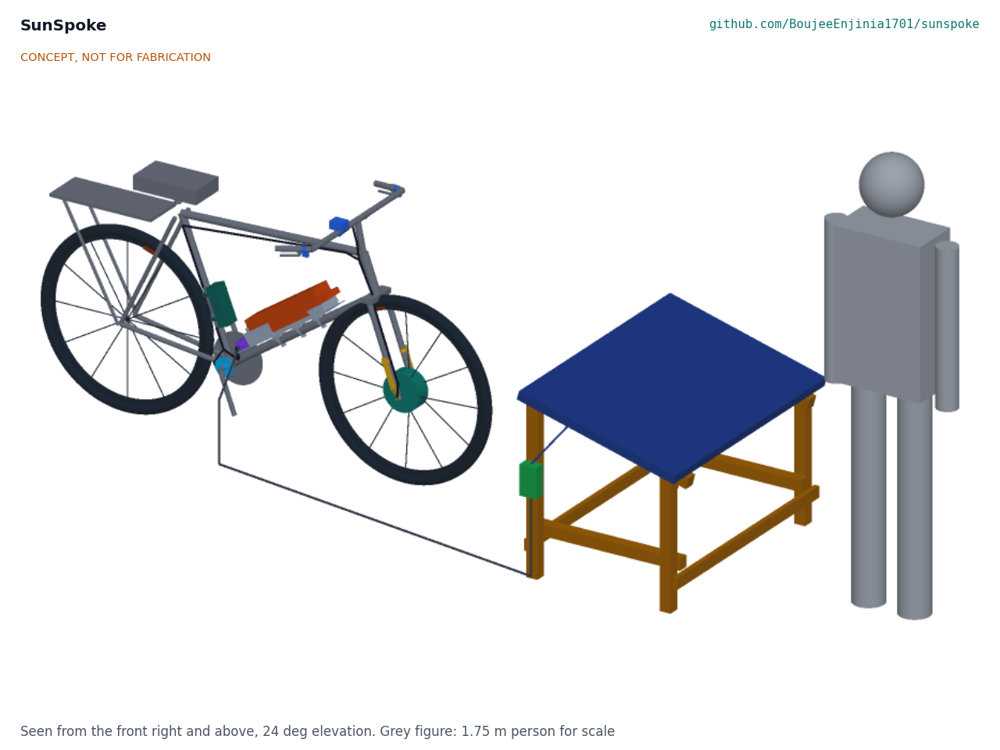
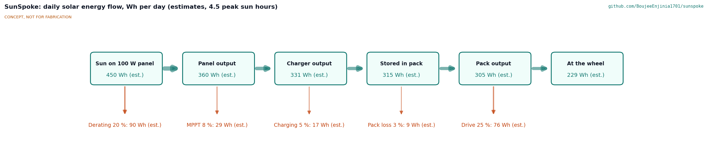
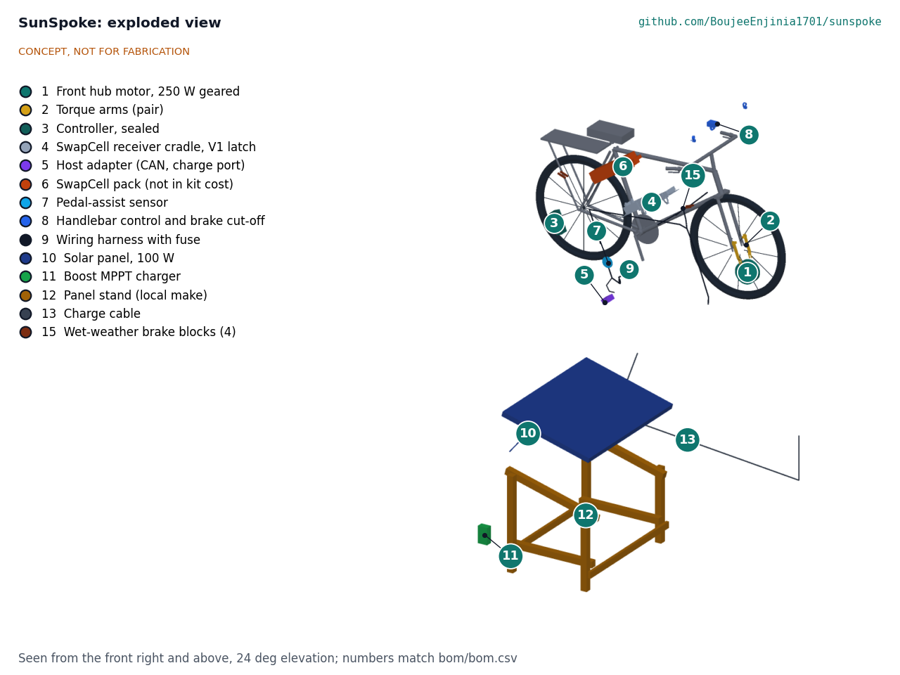

# SunSpoke design precis

SunSpoke converts a steel roadster bicycle into a pedal-assist e-bike with a 48 V, 250 W geared front hub motor, a sealed controller and a SwapCell pack clamped inside the main triangle, all bolted on with no welding, and charges the pack from one 100 W solar panel or a shared village hub. The sizing note SSP-CAL-001 gives about 37 km of loaded range on one pack, about 315 Wh stored per 4.5 sun-hour day from one panel (about 27 km of loaded riding), 6.88 kg of added mass, and a bike kit costing about USD 208 in parts (USD 42 under its USD 250 value-engineering target), with the solar set (about USD 90) costed separately and the pack priced in SwapCell. No requirement is shown to be not met; motor heating on a long loaded climb (R3, now handled by a thermistor derate rather than a cutout), fork slot fit (R4) and stopping distance (R11) are at risk.

*Figure 1. SunSpoke fitted to a 28 in roadster, with the 100 W solar charging set and a 1.75 m person for scale. Kit parts are colored; the donor bicycle is grey. Rendered from the parametric model `cad/src/model.py`.*

## How it works

1. **Charge.** A 100 W panel on a simple stand feeds a boost MPPT charger that raises the panel's roughly 18 V to the pack's charge voltage. A 5 m cable reaches the charge inlet on the host adapter, so the panel sits in sun while the bike and pack stay in shade. Alternatively the rider swaps the pack at a village hub that has a SwapCell dock.
2. **Store.** A SwapCell pack (13S2P, 46.8 V nominal, about 468 Wh) slides connector first down the receiver cradle on the down tube, and a drop-down gate closed by an over-centre draw latch preloads it against its end stop (SwapCell latch class V1). To swap it, the rider opens the latch, folds the gate down, slides the pack up the tube off its plug and lifts it out to the left.
3. **Wake and enable.** The cradle receptacle carries the 10 kΩ INTERLOCK coding resistor of SwapCell interface v0.3, in series with the handlebar power switch. Switching on closes the loop and wakes the pack with no supply from the bike. The pack enables legacy discharge after 2 s, which powers the host adapter; the adapter then sends the CAN heartbeat (mode 2). When the charger is connected the adapter, powered from the charge inlet, requests mode 3, or mode 4 (charge-discharge) if the bike is switched on.
4. **Sense.** A split-disc pedal-assist sensor at the crank detects pedaling. Magnetic sensors on both brake levers detect braking.
5. **Control.** A sealed 48 V, 15 A sine-wave controller on the seat tube drives the motor only while the rider pedals and no brake is applied, up to 20 km/h by default. It reads a thermistor in the motor winding and reduces current progressively from 110 °C so the winding never passes 120 °C; it never cuts assist abruptly on a climb. A handlebar unit sets the assist level, shows pack charge and has a 6 km/h walk-assist button. There is no throttle.
6. **Drive.** A 250 W geared hub motor, laced by a local mechanic into a standard 28 in (ETRTO 635) rim, replaces the front wheel. Torque arms on both fork blades carry the motor's reaction torque so it does not act on the thin dropouts alone.

Front drive leaves the roadster's chain, freewheel or coaster brake and rear carrier untouched, which is what makes a bolt-on fit and local repair realistic. If the host adapter fails, the pack still runs the bike in SwapCell legacy mode (discharge only, 15 A, the same as the controller limit), so the rider gets home.

*Figure 2. Daily solar energy flow from one 100 W panel at 4.5 peak sun hours, in Wh per day. All values are estimates from SSP-CAL-001.*

## Main components

Numbers match the exploded view (Figure 3) and `bom/bom.csv`. The general arrangement is drawing SSP-DWG-001 (`cad/drawings/SSP-DWG-001.pdf`), generated from `cad/src/model.py`.

| # | Component | Choice | Notes |
| --- | --- | --- | --- |
| 1 | Front hub motor wheel | 48 V, 250 W geared hub, slow winding, 100 mm spacing, 10 mm axle flats, built-in 10 kΩ NTC winding thermistor, laced into a 28 in steel rim | Donor tyre and tube reused. Decided by Amish, 2026-09-25 |
| 2 | Torque arms | 5 x 20 mm steel arms, slotted to fit the axle flats and joggled 8 mm to lie on the blade, each held 130 mm up its fork blade by a band clamp | Mandatory on both sides; made locally (SSP-DWG-107) |
| 3 | Controller | 48 V, 15 A limit, sine-wave, potted or IP65, pedal-assist, brake cut-off, power-lock, walk-assist and motor thermistor inputs; derate from 110 °C; on a rubber pad on the seat tube, two band clamps | Generic part; thermistor input decided by Amish, 2026-09-25 (SSP-DDR-002) |
| 4 | SwapCell receiver cradle | Folded 3 mm aluminium tray with guides, on three rubber-lined V-saddles held by three band clamps; slide strips, catch bar, end stop with the receptacle and its 10 kΩ coding resistor; drop-down gate with an over-centre draw latch | Latch class V1 vehicle receiver; fits 28 to 32 mm down tubes; no welding or drilling (SSP-DDR-003) |
| 5 | Host adapter and charge port | Microcontroller with CAN transceiver, diode-OR supply from PACK+ and the charge inlet, controller power-lock output | SwapCell vehicle host for modes 2, 3 and 4 |
| 6 | SwapCell pack | 13S2P, about 468 Wh, 340 x 90 x 80 mm, about 2.85 kg | Priced once in SwapCell ($414); not in the kit cost |
| 7 | Pedal-assist sensor | Split 12-magnet disc and Hall sensor | Fits without pulling the crank |
| 8 | Handlebar control and brake cut-off | LED level and charge display, power switch in the INTERLOCK loop, walk-assist button, two clamp-on lever sensors | Works with rod or cable brake levers |
| 9 | Wiring harness | Keyed waterproof connectors, 20 A fuse, spiral wrap | Every joint pluggable (R9) |
| 10 | Solar panel | 100 W monocrystalline, about 1,000 x 670 mm | Costed separately; can be shared at a hub |
| 11 | Boost MPPT charger | 15 to 25 V in, CC/CV to 54.6 V at up to 2 A out | Generic; the host adapter is the SwapCell charge host |
| 12 | Panel stand | Bolted timber A-frame, 45 x 45 mm sawn timber, 15 degree tilt | Local make (SSP-DWG-108 to 110) |
| 13 | Charge cable | 5 m outdoor cable with keyed plug to the charge inlet | Pack charges in shade |

*Figure 3. Exploded view with numbered callouts matching the BOM. The solar charging set is shown displaced below the bike.*

## Key numbers

All values come from SSP-CAL-001 (`docs/04-calcs/sizing.py`) and are paper estimates. The design load case is 128.88 kg (75 kg rider, 25 kg cargo, 22 kg roadster, 6.88 kg of kit and pack) on a dry dirt road.

| Quantity | Value | Basis | Requirement |
| --- | --- | --- | --- |
| Pack energy, design case | about 11.3 Wh/km | Crr 0.02, CdA 0.6 m², 18 km/h, 30 % allowance, rider 70 W, drive 75 % | |
| Range on SwapCell | about 37 km design (36 with minimum cells); 75 km light; 23 km with 80 kg cargo | 419 Wh usable | R2 met |
| Motor on the 8 % grade at 8 km/h | 204 W and 32.6 N·m (81 % of a 40 N·m peak) | 127.7 N, rider 80 W | R3 met on power |
| Motor winding, top of 500 m at 35 °C | about 100 °C base case; about 139 °C hot case | Lumped thermal model | R3 **at risk** |
| Thermal derate from 110 °C | Starts after 694 m (base) or 224 m (hot) of the 8 % climb; sustained 4.7 or 3.7 km/h on an unending climb | Winding held at 120 °C, rider 80 W | R3 |
| Added mass | 6.88 kg (kit 4.03, pack 2.85) | Table 2 of SSP-CAL-001 | R6 met, 0.12 kg margin |
| Solar, one 100 W panel | 315 Wh/day stored (280 at 4 h); about 27 km of loaded riding per day | 20 % derating, 92 % MPPT, 95 % charging | R8 met |
| Recharge 10 to 100 % | 1.3 days (1.5 at 4 h) | 421 Wh / 315 Wh per day | R8 met |
| Peak charge current | 1.47 A (0.15C); 1.39 A net in mode 4 | 74 W into about 50 V | R13 |
| INTERLOCK node | 0.30 V, 30 µA | 10 kΩ against a 100 kΩ pull-up | R13 |
| Torque arms | 154 N per clamp; 60 MPa in the arm, safety factor 4.2 | 40 N·m peak at 130 mm | R10 |
| Dropout slot filing | about 0.24 mm per side on a 9.53 mm slot | 10 mm flats | R4 **at risk** |
| Cradle retention at 25 g | Axial margin 7.7; rotation margin 1.44 | 3.5 kg pack plus 1.10 kg cradle, three band clamps over V-saddles | R13, not verifiable |
| Pack fit in the triangle | 121 mm clearance; 165 mm free travel for removal (143 needed); removal path checked against every cradle part | Parametric model, pack at 48 % of the down tube | R5 met on paper |
| Stopping from 20 km/h | 8.5 m dry; 21.8 m wet with standard blocks, 11.9 m wet with wet-weather blocks (assumed friction 0.25) | Rod brakes on steel rims, 0.5 s delay | R11 **at risk** |
| Bike kit cost | about USD 208, USD 42 under the USD 250 value-engineering target | Items 1 to 5, 7 to 9, 14, 15 | R12 met |
| Solar set cost | about USD 90 | Items 10 to 13, costed separately | |
| SwapCell pack | $414, priced in SwapCell (SWC-CAL-001) | Excluded from the kit | |

### Fork and frame torque

The motor pushes against its own axle. At the assumed 40 N·m peak, the axle flats would load each bare dropout face with about 4 kN, enough to spread or crack thin stamped dropouts over time. Torque arms move the reaction to clamps 130 mm up each blade, about 154 N each. Roadster slots are often 3/8 in (9.53 mm), so the 10 mm flats may need about 0.24 mm filed from each face; whether that is acceptable with torque arms fitted is open (SSP-DDR-001 item 15). Braking and pothole loads also rise with the heavier front wheel and higher speed; the fork's fatigue margin is unverified.

## Key design choices

All of these were decided by Amish on 2026-09-25 (go with recommendation), in SSP-DDR-001 or SSP-DDR-002.

- **48 V on the SwapCell pack (Option A).** Meets R2, shares packs and docks with other portfolio vehicles and keeps the pitch. A 36 V kit with its own generic pack (Option B) is kept only as a later low-cost variant.
- **Budget covers the bike kit.** `budget_usd` stays at USD 250, a value-engineering target, and R12 applies to the bike kit (about USD 208); the solar set is costed separately and the pack is priced once in SwapCell.
- **Front geared hub motor.** Leaves the drivetrain, rear brake and carrier untouched and is the easiest bolt-on.
- **Pack in the main triangle on the down tube.** Keeps the rear carrier free and the mass low and central.
- **Motor laced locally into a 28 in rim**, with a lacing card.
- **Assist cut-off 20 km/h by default**, adjustable only by the mechanic and never above 25 km/h. SSP-CAL-001 shows the loaded bike stops in about 8.5 m from 20 km/h but about 12.4 m from 25 km/h on dry dirt.
- **Pedal assist only, plus a 6 km/h walk assist.** No throttle.
- **Charge on the bike.** The charger plugs into the host adapter's charge inlet and the adapter acts as the SwapCell charge host; hub docks remain an option.
- **SwapCell interface v0.3 items W, C and V.** The cradle fits the 10 kΩ coding resistor (W), the adapter uses mode 4 when the bike is on while charging (C), and the cradle is a latch class V1 receiver (V).
- **Power switch in the INTERLOCK loop, adapter powered from legacy discharge or the charge inlet.** Decided by Amish, 2026-09-25: go with recommendation (SSP-DDR-002). Switching off opens the pack output, a hard off that needs no electronics on the bike.
- **Controller with a motor thermistor input (R3).** Decided by Amish, 2026-09-25: go with recommendation (SSP-DDR-002). The motor carries a winding thermistor and the controller derates from 110 °C instead of cutting out.

## Safety

> **Safety:** SunSpoke carries a lithium-ion pack of about 468 Wh, drives a loaded bicycle faster than its rider alone, and puts new loads on an old steel fork. Treat each of these as a hazard at every stage.

- **Lithium pack.** A cell in thermal runaway vents flammable, toxic gas and can ignite its neighbors. Use only a SwapCell pack with its BMS, fuse the harness (item 9), charge on a non-combustible surface in shade and away from sleeping areas, never charge a pack that is damaged, swollen or has been submerged, and keep the pack out of direct sun when parked. The pack refuses charge below 0 °C and above 45 °C cell temperature.
- **Pack retention.** A pack that leaves its cradle at speed is a 2.85 kg projectile with live contacts. The cradle must meet SwapCell latch class V1, the draw latch must have its safety catch engaged, and the three band clamps must be tightened to their stated torque and checked at every service; rotation resistance at a 25 g lateral shock has only about 1.44 margin on paper.
- **Fork dropout failure.** A spun axle can rip the motor cable and let the wheel leave the fork, which throws the rider over the bars. Torque arms on both sides are mandatory, axle nuts need a set torque and a check at every service, and a fork with cracked, bent or heavily filed dropouts must not be converted. Fork fatigue under the heavier wheel is unverified.
- **Braking with added speed and mass.** At 20 km/h the loaded bike carries about 2.0 kJ, about 2.5 times the unconverted bike at 13 km/h. Rod brakes on steel rims lose most of their grip in rain: about 22 m to stop from 20 km/h wet against 8.5 m dry; with the wet-weather blocks, assuming a friction of 0.25, the wet stop is about 11.9 m, inside a proposed wet target of 14 m. Brake cut-off sensors on both levers, the 20 km/h limit, and a brake check at fitting with new wet-weather blocks suited to steel rims are part of the kit (decided 2026-10-02). R11 now has a wet stopping target, and no trial is ridden in the wet until a wet braking test meets it (SSP-DEC-001). Braking with only the front brake on loose ground can wash out the front wheel.
- **Motor overheating.** On a long loaded climb in the heat the winding may exceed its limit (R3). A sudden cutout on a hill can stall a loaded bike, so the controller derates on the motor thermistor instead (decided, SSP-DDR-002); the bike slows to walking pace on a very long hot climb but keeps moving.
- **Wiring in rain.** The system is about 50 V DC, below the usual touch-safety threshold, but water in connectors causes corrosion, shorts and sudden loss of assist. Use keyed IP65 connectors with dielectric grease, drip loops, and routing that keeps the motor cable exit facing down. The fuse protects against a pinched cable shorting to the frame. Opening the power switch opens the pack output within 1 ms.
- **Traction.** With cargo on the rear carrier, the front wheel carries little weight and a front motor can spin on sand or wet laterite. Assist ramp-up must be soft.

## Open questions

These remain after SSP-DDR-001. None of them is TRL 4 work to be started now; TRL 4 is on hold by Amish's instruction.

- First partner and region for co-design and fitting trials. Decided 2026-10-02: western Kenya and eastern Uganda as the default region, with a bicycle mechanics' group or rural transport organization there as the partner type; the partner is named when the portfolio picks partners for this area (SSP-DEC-001).
- Slot filing (R4). Decided 2026-10-02: never file the fork for now; choose donors whose slots take 10 mm flats, and if the donor survey shows 3/8 in slots are the norm, look first for a motor whose axle flats fit them (SSP-DEC-001).
- Motor data for R3: winding resistance, thermal capacity and gear temperature limit. Decided 2026-10-02: the reference motor is a widely sold 250 W front geared hub such as one of Bafang's; its maker is asked for the data and R3 is rerun, and the winding resistance is measured at TRL 4 if the data are not published (SSP-DEC-001).
- Wet braking: decided 2026-10-02, R11 adds a wet stopping target (proposed value 14 m from 20 km/h, awaiting Amish), wet-weather brake blocks suited to steel rims go in the kit, and trials keep a no-wet-riding rule until a wet braking test meets the target (SSP-DEC-001).
- The legacy-to-heartbeat transition in the SwapCell pack. Raising it with the SwapCell project is decided (SSP-DDR-002); the change belongs to that repo.
- Confirm that a low-cost boost charger with input-voltage tracking gives near-MPPT yield from one 18 V panel.

Concept media: [blueprint sheet](../media/concept-blueprint.pdf), [interactive 3D model](../media/viewer.html).
