# SunSpoke prototype build plan

**Plan, not yet built.** How to build the first proof-of-concept prototype, component by component. Building and testing to it is TRL 4 work. Decisions still to be made are kept in the design decisions register ([docs/06-design-decisions.md](06-design-decisions.md)), not here.

## 1. What you are building

*Figure 1. The kit on the donor bicycle, pulled apart and numbered in build order. The SwapCell pack (11) comes from the SwapCell project; the frame, fork and bars (12) are the rider's own.*

The prototype is one SunSpoke kit fitted to a 28 in steel roadster, plus its solar charging set. On the bike: a receiver cradle clamped to the down tube that holds a SwapCell pack, a 250 W hub motor laced into a new front wheel with a torque arm on each side of the fork, a sealed controller strapped to the seat tube, a pedal-assist sensor at the bottom bracket, a display and two brake sensors on the handlebar, and a harness joining them. Off the bike: a 100 W panel on a timber stand with a charger and a 5 m cable to the bike. Figure 1 shows the 11 kit components in the order you fit them. Made in a small workshop: the cradle's tray, V-saddles, slide strips, catch bar, end stop and gate, the two torque arms and the panel stand. Bought and fitted: the motor, controller, sensors, display, harness, host adapter, receptacle, hinge, draw latch, band clamps, panel, charger and cable. The work is cutting, folding and drilling aluminium sheet, sawing and filing steel and aluminium bar, sawing and bolting timber, lacing a wheel, and plugging bought electrical parts together. Nothing is welded, and nothing is drilled or cut on the donor frame or fork. The bike kit parts cost about USD 196 and the solar set about USD 90, from the bill of materials.

> **Safety:** The kit runs from a 468 Wh lithium-ion SwapCell pack at up to 54.6 V DC, drives a loaded bicycle at up to 20 km/h, and puts new loads on an old steel fork. Keep the pack away from the bike and the fuse out until section 6 says otherwise. Cut aluminium and steel edges are sharp: deburr everything and wear gloves when handling sheet and bar. Never ride the prototype on a road; first rides are TRL 4 tests on a closed site.

### Choosing the donor bicycle

Pick a donor that the kit fits without any work on the frame or fork. It needs: a round down tube 28 to 32 mm across; front dropouts 100 mm apart inside, with slots that take the motor's 10 mm axle flats without filing (try a 10 mm gauge or the motor axle itself); a cup-and-cone bottom bracket with a lockring on the left cup; rod or cable rim brakes in good order, with new blocks fitted; and a fork and frame with no cracks, dents or rust through. Measure the step from the outside face of each dropout to the outside of its fork blade: the torque arms are made for 8 mm.

## 2. What changed to make it buildable

The concept showed what the kit does; many of its parts could not be made or fixed as drawn, and the pack could not be taken out. Each change below keeps what the kit does, and all of them are recorded in decision record SSP-DDR-003, open for Amish's review.

*Table 1. Changes from the concept.*

| Component | The concept had | The buildable design has | Why |
| --- | --- | --- | --- |
| Cradle base | A flat steel plate with a block cut into the down tube | A folded aluminium tray on three V-saddles with rubber liners (Figures 3 and 6) | The V seats on any 28 to 32 mm tube; aluminium keeps the mass down |
| Band clamps | Two rings round the tube passing through the plate | Three band clamps through slots in the tray, round the saddle and tube (Figure 6) | A band cannot pass through a plate; three bands keep the concept's grip with the real band path |
| End stop | A solid block with the receptacle inside it | A folded aluminium end stop with a plug notch, the bought receptacle bolted behind it (Figure 10) | It can be cut, folded and drilled by hand |
| V1 lever | Three loose blocks; the hinge block stood in the pack's way out | A drop-down gate with a rubber pad, on a hinge, closed by an over-centre draw latch (Figures 12 and 13) | Same preload and over-centre lock; folded down, nothing blocks the pack |
| Slide rails and catch | Steel bars and a block with no fixing | Plastic slide strips and a steel catch bar on screws (Figures 7 and 8) | Low friction; no screw heads where the pack slides |
| Host adapter | Floating beside the tube | On an extension of the tray, with a lead to the receptacle (Figure 2, step 4) | Uses the tray |
| Torque arms | Plates running into the fork blades; clips not joined to them | Joggled arms with an open slot on the axle flats, held by a band clamp round blade and arm (Figures 14 to 16) | The arm lies flat on the dropout and on the blade, as a torque arm must |
| Controller | Floating in front of the seat tube | On a rubber pad, held by two band clamps (Figure 22) | No drilling of the frame |
| Pedal-assist sensor | A disc on nothing and no sensor | A disc clamped on the spindle and a sensor on a bracket under the left lockring (Figure 23) | How bolt-on sensors fit this bottom bracket |
| Display and brake sensors | Boxes cutting into the bar | Each on its own bar clamp; magnets on the brake levers (Figure 24) | Fits the donor's own levers |
| Harness | Running through open space and the cradle | Along the left side of the tubes on cable ties (step 11) | Clear of the cradle, wheel and cranks |
| Panel stand | Legs running into the panel; nothing holding the panel | A bolted timber A-frame; the panel bolts to its rails (Figures 17 to 21) | No welding, local timber |

## 3. Making the components

Make and check each component before the assembly step that needs it. Sizes are in millimetres. "Left" and "right" are as the rider sits on the bike. On the cradle, "lower end" is the bottom bracket end and "top end" the head tube end. Workshop tolerance is 0.5 mm unless a step says otherwise; drawings do not carry tolerances before TRL 4.

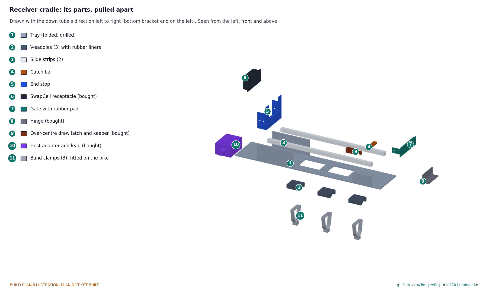

*Figure 2. The receiver cradle's own parts (sections 3.1 to 3.6), pulled apart. It is built on the bench and clamped to the bike in step 5.*

### 3.1 Cradle tray

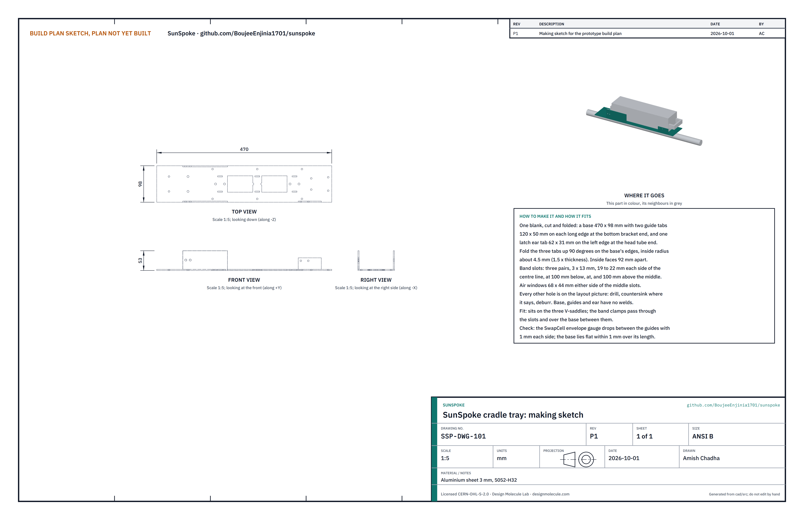

*Figure 3. Cradle tray making sketch (SSP-DWG-101).*

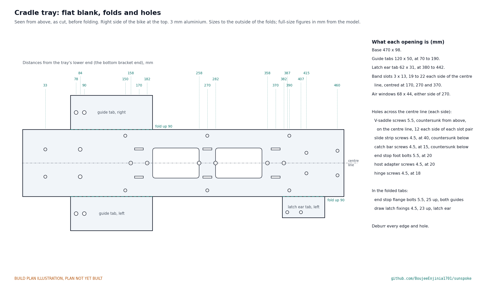

*Figure 4. The tray as cut, before folding, with every hole and fold, measured from its lower end and sideways from the centre line.*

**What it is and what it is made from.** The folded tray the pack slides on: a base, two guide walls at its lower end that keep the pack's connector lined up, and an ear at its top end that carries the draw latch. Aluminium sheet 3 mm, 5052-H32 (a grade that folds without cracking).

**How to make it.**

1. Mark the blank of Figure 4 on the sheet: a base 470 x 98 with two guide tabs 120 x 50, one on each long edge from 70 to 190 from the lower end, and a latch ear tab 62 x 31 on the left edge from 380 to 442. Cut it out with a jigsaw and a metal blade, or snips, and file the edges straight.
2. Drill a 3 mm relief hole at each inside corner where a tab meets the base, so the fold does not tear.
3. Mark and cut the six band slots, 3 x 13, a pair at each of 170, 270 and 370 from the lower end, 19 to 22 either side of the centre line: chain drill 3 mm and file square.
4. Cut the two air windows, 68 x 44, either side of 270, with 4 mm corner radii: drill the corners 8 mm and cut between with the jigsaw.
5. Drill every other hole in Figure 4. Countersink the six V-saddle holes from the top face, and the slide strip and catch bar holes from the bottom face.
6. Fold the three tabs up 90 degrees in a vice between two lengths of steel angle, over a 4.5 mm radius (a 9 mm rod). Check the inside faces of the guides are 92 apart and square to the base.
7. Deburr every edge and hole.

**How it fits the parts next to it.** The base sits on the three V-saddles (Figure 6); the band clamps go down through the slots and back over the base between them. The slide strips and catch bar sit on its top face, the end stop between the guides, and the latch on the outside of the ear.

**Check before moving on.** A SwapCell envelope gauge (or the pack itself, unpowered) drops between the guides with about 1 mm each side. The base lies flat within 1 mm along its length.

### 3.2 V-saddles (make 3)

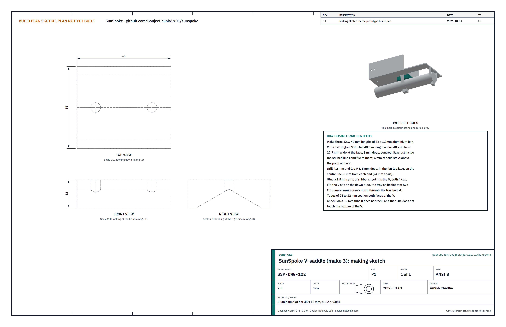

*Figure 5. V-saddle making sketch (SSP-DWG-102).*

**What it is and what it is made from.** A short block with a wide V cut along its underside, one at each band clamp, that seats the tray squarely on the round down tube. Aluminium flat bar 35 x 12, 6082 or 6061, with a strip of 1.5 mm rubber sheet glued in the V.

**How to make it.**

1. Saw three 40 lengths of the bar and square the ends.
2. On one 40 x 35 face, scribe a 120 degree V running the full 40 length: 27.7 wide at the face and 8 deep, centred. Saw just inside the lines and file to them, leaving 4 of solid metal above the point of the V.
3. In the flat face opposite the V, drill 4.2 and tap M5, 8 deep, on the centre line, 8 in from each end (24 apart).
4. Glue a strip of 1.5 mm rubber sheet, 40 x 30, into the V with contact adhesive, covering both faces.

**How it fits the parts next to it.**

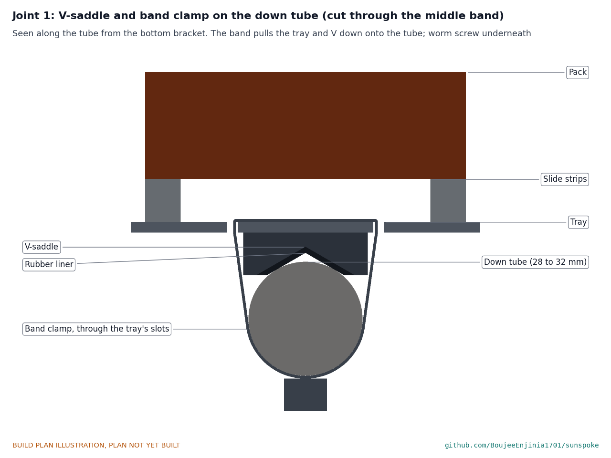

*Figure 6. Cut through the middle band, seen along the tube. The band runs from the tray's top face down through its slots, round the saddle and the tube, with its screw underneath; tightening it pulls the V onto the tube.*

The flat top of the saddle sits under the tray, held by two M5 countersunk screws down through the tray. The down tube bears on both faces of the V through the rubber and never touches the point of the V; tubes from 28 to 32 all seat this way.

**Check before moving on.** On a 32 tube the saddle does not rock, and you can see light at the point of the V but not along its faces.

### 3.3 Slide strips (make 2)

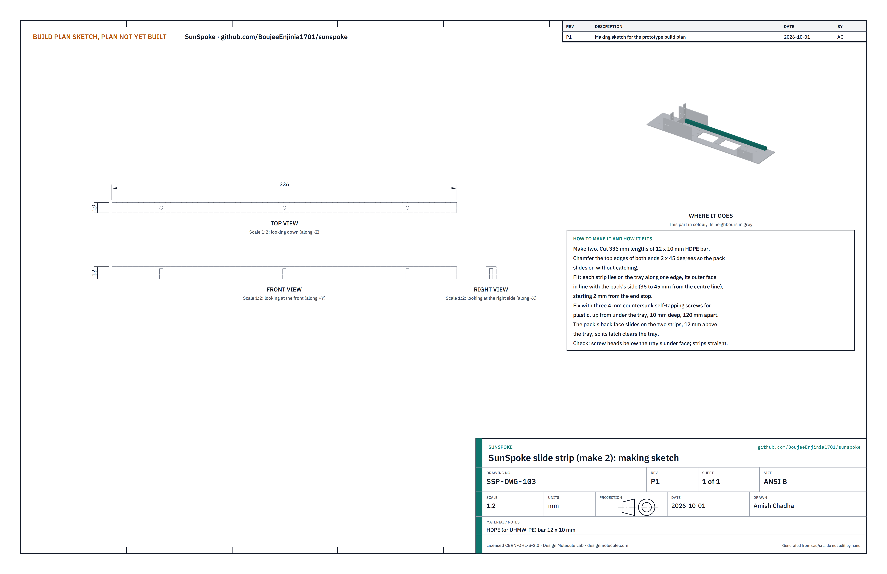

*Figure 7. Slide strip making sketch (SSP-DWG-103).*

**What it is and what it is made from.** Two plastic strips that the pack's back face slides on, holding it 12 above the tray so its own latch clears the tray. HDPE or UHMW-PE bar 12 x 10.

**How to make it.**

1. Saw two 336 lengths.
2. Chamfer the top edge of each end 2 x 45 degrees.
3. Lay each strip on the tray in place and mark its three screw holes through the tray from below; drill 3.2, 10 deep, into the strip.

**How it fits the parts next to it.** Each strip lies on the tray along one edge, 35 to 45 from the centre line, starting 2 from the end stop. Three 4 countersunk self-tapping screws for plastic go up through the tray into each strip; their heads sit below the tray's underside. The pack slides on the two strips (Figure 6).

**Check before moving on.** Both strips straight and the same height; no screw tip shows on the top face.

### 3.4 Catch bar

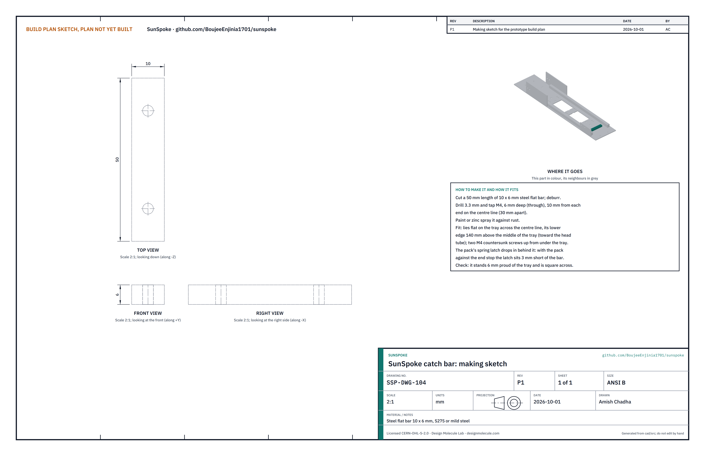

*Figure 8. Catch bar making sketch (SSP-DWG-104).*

**What it is and what it is made from.** A small steel bar across the tray that the pack's own spring latch drops in behind, so the pack cannot slide out if the gate is ever left open. Steel flat bar 10 x 6.

**How to make it.**

1. Saw a 50 length and deburr it.
2. Drill 3.3 and tap M4 right through, on the centre line, 10 in from each end.
3. Paint it or spray it with zinc.

**How it fits the parts next to it.** It lies flat across the tray's centre line, its lower edge 410 from the tray's lower end (140 above the middle), on two M4 countersunk screws up from below. With the pack against the end stop, its latch sits 3 short of the bar (Figure 12).

**Check before moving on.** It stands 6 proud of the tray and square across it.

### 3.5 End stop and receptacle

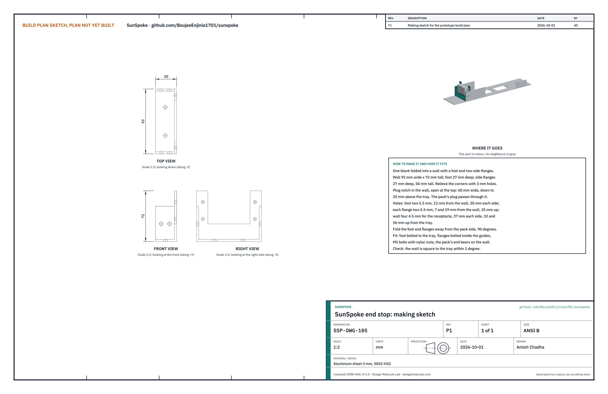

*Figure 9. End stop making sketch (SSP-DWG-105).*

**What it is and what it is made from.** The wall at the tray's lower end that the pack is pressed against, with a notch the pack's plug passes through into the SwapCell receptacle behind it. Aluminium sheet 3 mm, 5052-H32, folded into a wall with a foot and two side flanges.

**How to make it.**

1. Mark one blank: the wall 92 wide x 72 tall in the middle, a foot 27 deep below it, and a side flange 27 deep x 50 tall on each side. Cut it out and drill 3 mm relief holes at the corners.
2. Cut the plug notch in the wall, open at the top, 60 wide, down to 25 above the bottom edge.
3. Drill: two 5.5 holes in the foot, 13 from the wall and 20 each side of centre; two 5.5 holes in each flange, 7 and 19 from the wall, 25 up; four 4.5 holes in the wall for the receptacle, 37 each side of centre, 32 and 56 up.
4. Fold the foot and both flanges 90 degrees away from the pack side.
5. Hold the receptacle against the back of the wall, its socket centred in the notch, and check its four holes line up.

**How it fits the parts next to it.**

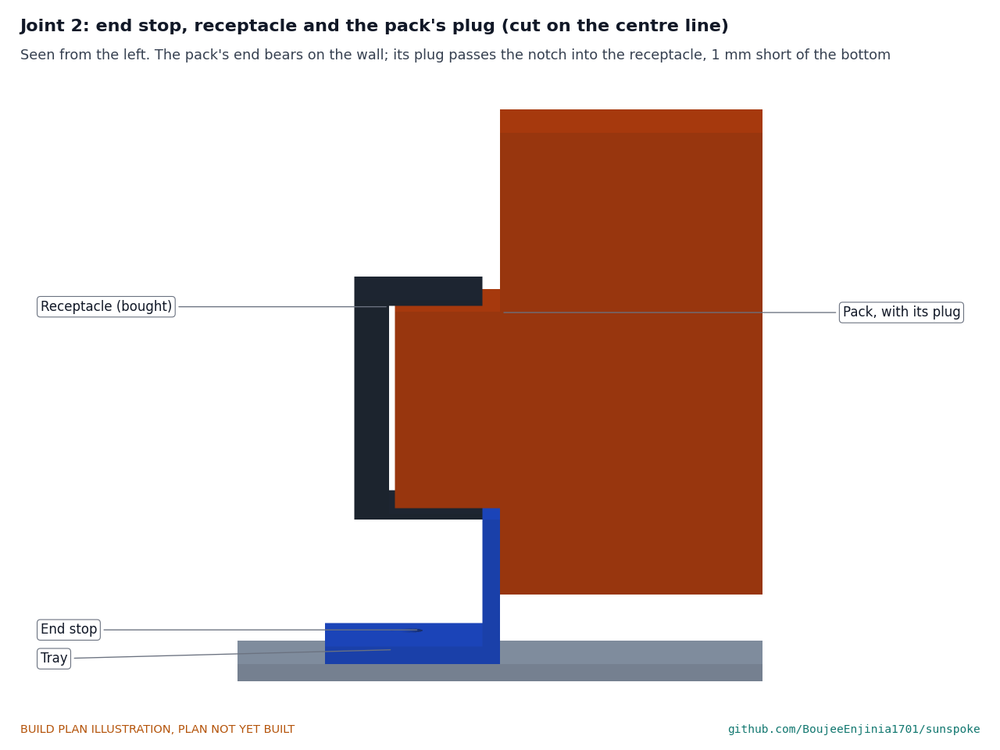

*Figure 10. Cut on the centre line, seen from the left. The pack's end bears on the wall; its plug passes the notch into the receptacle and stops 1 short of the bottom.*

The foot lies on the tray and the flanges against the inside of the guides, all on M5 bolts with nyloc nuts. The receptacle, with its 10 kΩ coding resistor already fitted by its maker, bolts to the back of the wall on four M4 bolts with nyloc nuts.

**Check before moving on.** The wall is square to the tray within 1 degree; the pack (unpowered) slides down onto the plug and seats on the wall without forcing.

### 3.6 Gate, hinge and draw latch

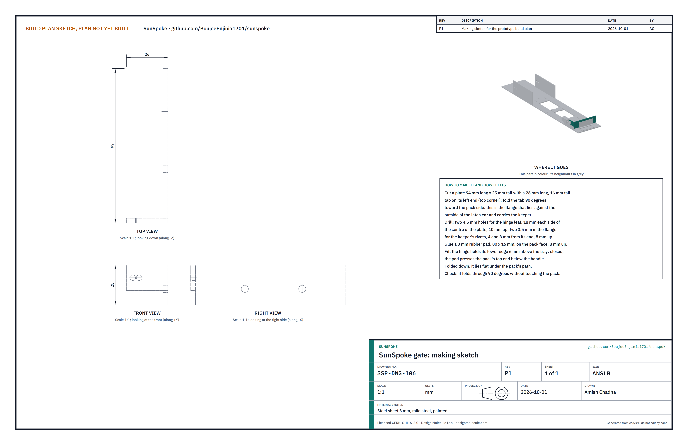

*Figure 11. Gate making sketch (SSP-DWG-106).*

**What it is and what it is made from.** The part that holds the pack against the end stop. A small steel plate on a hinge at the tray's top end presses the pack's top end through a rubber pad; an over-centre draw latch on the tray's left ear pulls it closed and locks with a safety catch. Opened, the gate folds flat so the pack can slide out over it. Steel sheet 3 mm; a stainless butt hinge 60 long; a stainless adjustable draw latch with keeper and safety catch; a 3 mm rubber pad.

**How to make it.**

1. Cut a plate 94 long x 25 tall with a tab 26 long x 16 tall on its left end at the top. Fold the tab 90 degrees toward the pack side: this is the flange that lies against the outside of the latch ear.
2. Drill two 4.5 holes for the hinge, 18 each side of the plate's centre, 10 up from its bottom edge; and two 3.5 holes in the flange for the keeper, 4 and 8 from its end, 8 up.
3. Paint it.
4. Glue an 80 x 16 rubber pad, 3 thick, on the pack face, 8 up from the bottom edge.
5. Rivet or bolt the keeper on the outside of the flange.

**How it fits the parts next to it.**

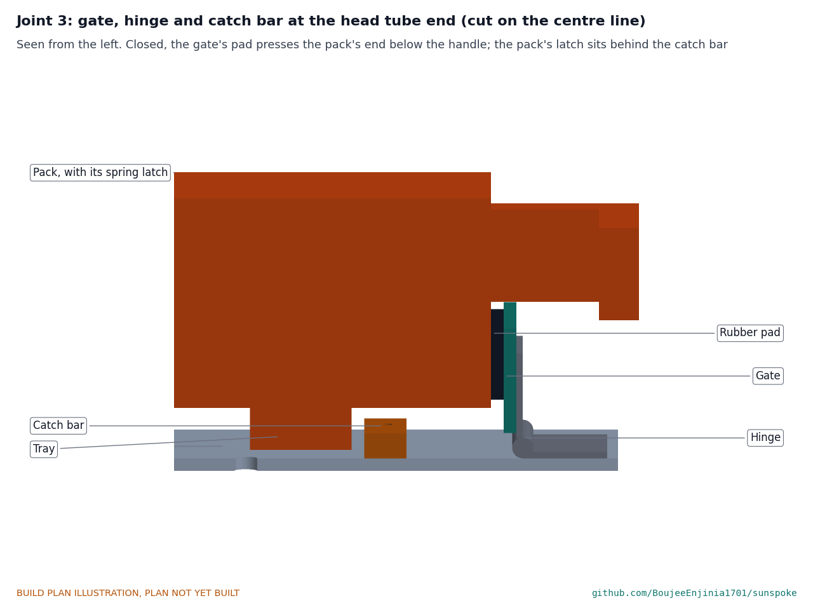

*Figure 12. Cut on the centre line, seen from the left. Closed, the pad presses the pack's top end below the handle, and the pack's latch sits behind the catch bar.*

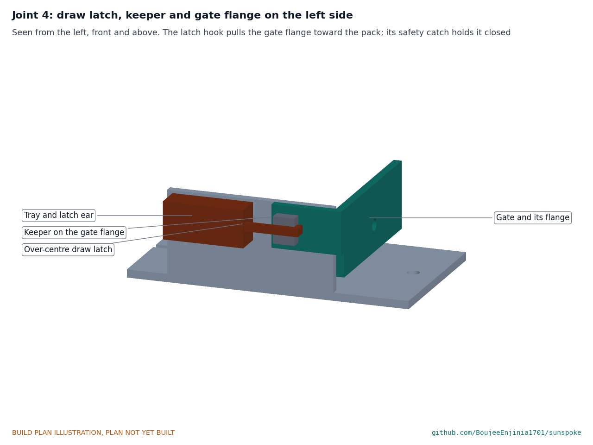

*Figure 13. The latch on the outside of the ear; its hook pulls the gate's flange toward the pack.*

The hinge's lower leaf lies on the tray 1.5 beyond the gate (two M4 bolts with nyloc nuts); its upper leaf lies on the gate's back face (two M4 bolts), holding the gate's bottom edge 6 above the tray. Closed, the gate stands 2 below the pack's handle and the flange lies against the outside of the ear. Adjust the latch hook so the latch needs a firm push to go over centre, then flip the safety catch; the preload it gives is measured in the first checks (section 5). Opened, the gate folds forward and lies flat on the hinge, below the strips.

**Check before moving on.** The gate folds through 90 degrees without touching anything; closed, the latch snaps over centre with one hand and its catch engages.

### 3.7 Torque arms (make 2, a left and a right)

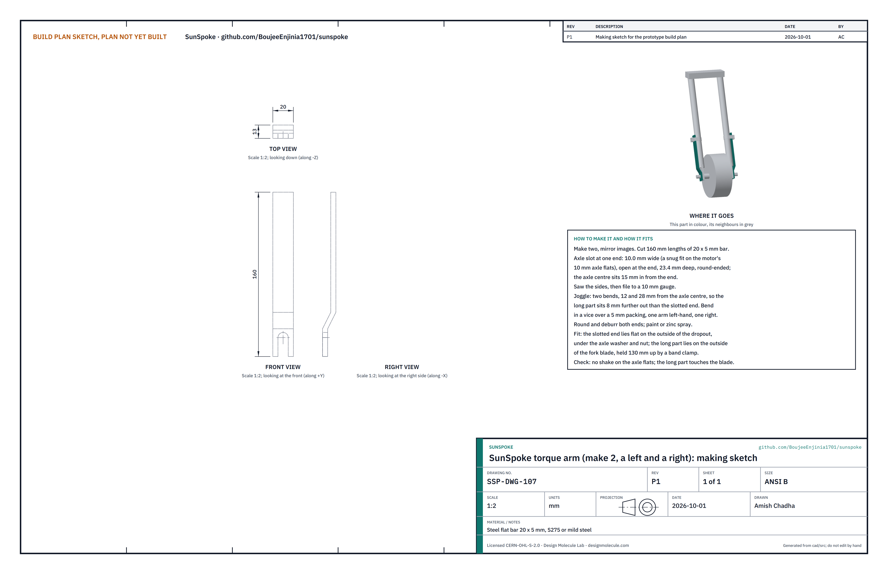

*Figure 14. Torque arm making sketch (SSP-DWG-107).*

**What it is and what it is made from.** An arm on each side of the fork that stops the motor's axle turning in the thin dropouts: its slotted end fits over the axle flats and its long end is clamped to the fork blade. Steel flat bar 20 x 5, S275 or mild steel.

**How to make it.**

1. Saw two 160 lengths.
2. Cut a slot in one end, 10.0 wide, open at the end and 23.4 deep with a round end: saw the two sides, break out the middle and file to a 10 mm gauge so it is a snug fit on the axle flats. The axle centre sits 15 in from the end.
3. Joggle each arm 8 in a vice: bend at 12 and at 28 from the axle centre, over a 5 packing, so the long part is offset 8 from the slotted end. Make one left-handed and one right-handed.
4. Round and deburr both ends; paint or zinc spray.

**How it fits the parts next to it.**

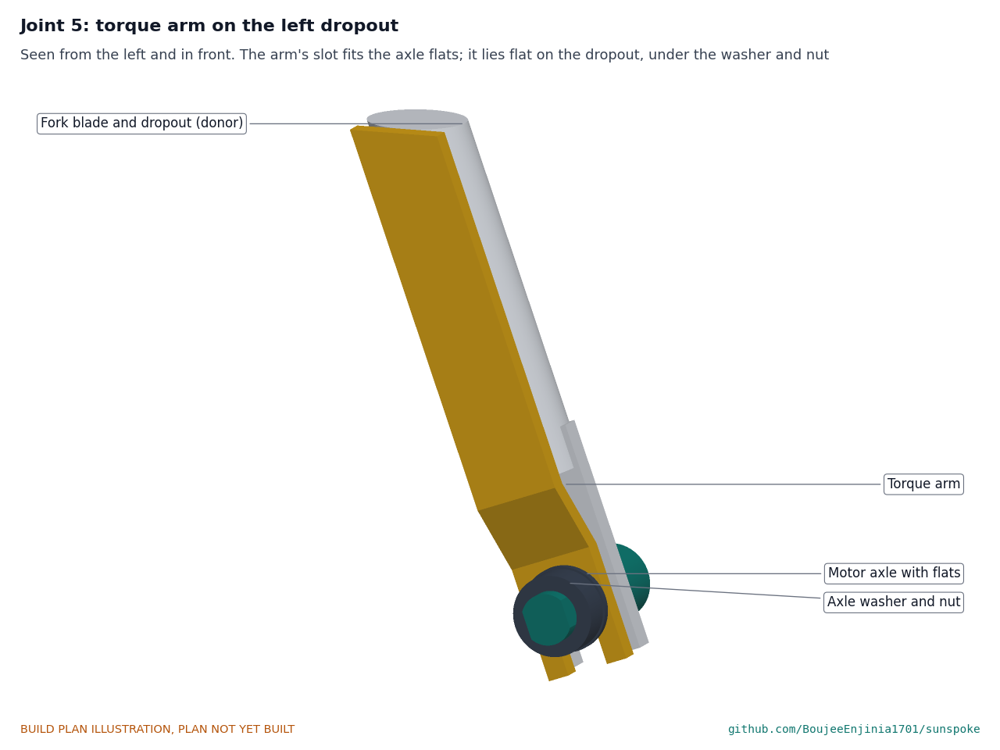

*Figure 15. The slotted end lies flat on the outside of the dropout, keyed on the axle flats, under the washer and axle nut.*

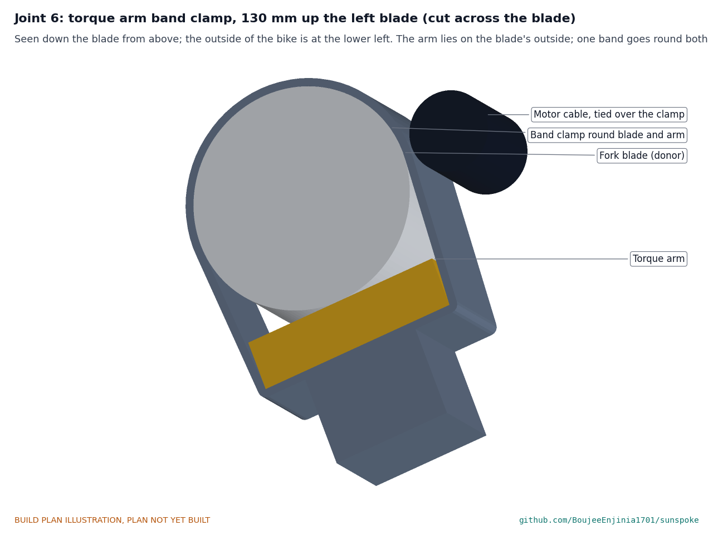

*Figure 16. Cut across the blade, 130 up: the arm lies on the outside of the blade and one band clamp goes round both. The motor cable is tied over the clamp.*

The slotted end sits on the dropout's outside face, the axle washer and nut on top of it. The joggle takes the arm out past the blade so its long part lies against the outside of the blade, where a 12 band clamp 130 up the blade holds it.

**Check before moving on.** The slot slides onto the axle flats with no shake; on the donor, the long part touches the blade along its length with the slotted end flat on the dropout.

### 3.8 Panel stand

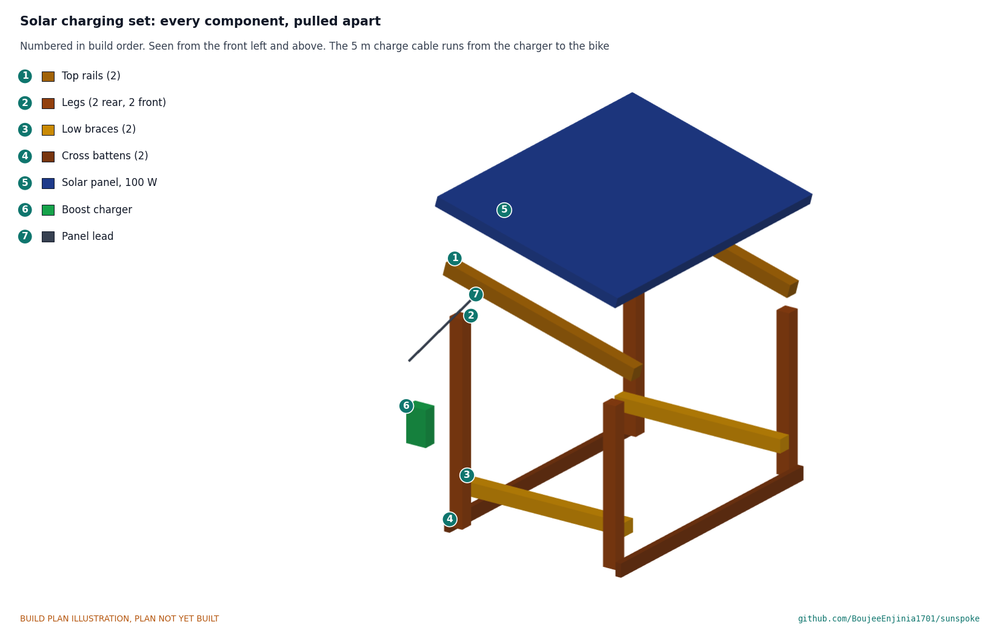

*Figure 17. The solar charging set, pulled apart and numbered in build order.*

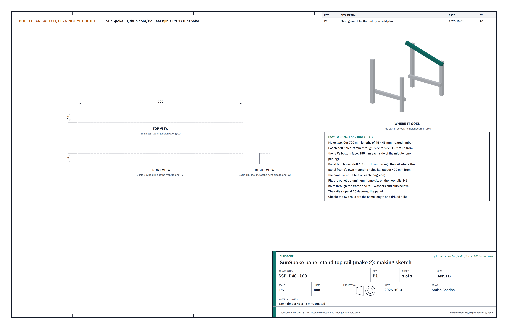

*Figure 18. Top rail making sketch (SSP-DWG-108).*

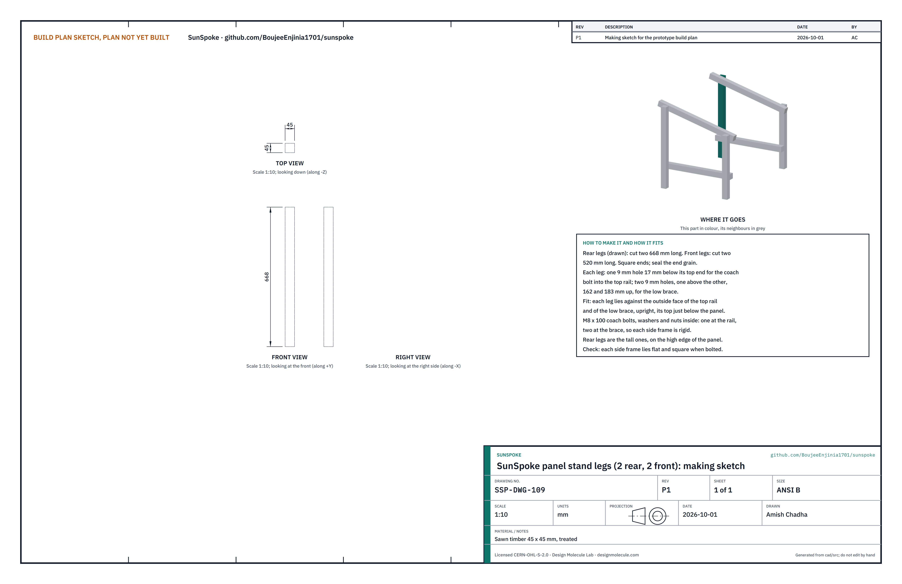

*Figure 19. Legs making sketch (SSP-DWG-109).*

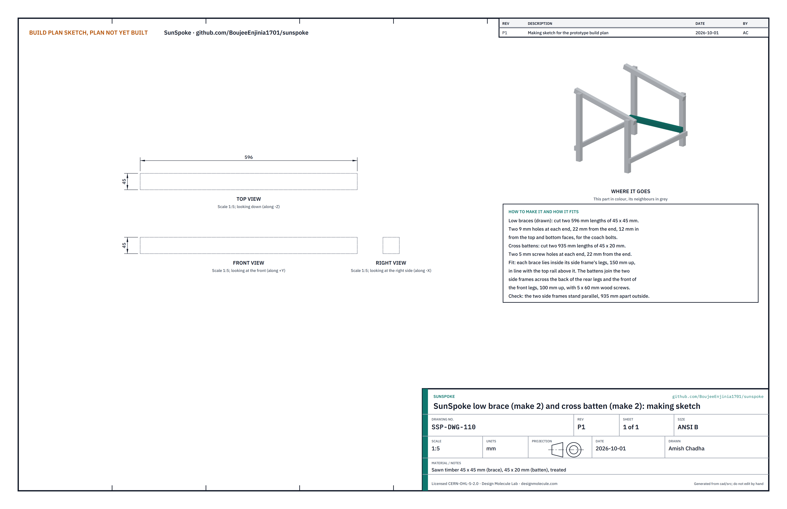

*Figure 20. Low brace and cross batten making sketch (SSP-DWG-110).*

**What it is and what it is made from.** An A-frame that holds the panel at 15 degrees, about 0.5 to 0.7 m off the ground, with the charger in its shade. Treated sawn timber 45 x 45 for the rails, legs and braces, 45 x 20 for the battens; M8 x 100 coach bolts; M6 bolts for the panel; 5 x 60 wood screws.

**How to make it.**

1. Cut two top rails 700, two rear legs 668, two front legs 520, two low braces 596 and two cross battens 935. Seal the end grain.
2. Drill 9 holes for the coach bolts: in each rail, one 15 up from its bottom face at 285 each side of its middle; in each leg, one 17 below its top end and two, one above the other, at 162 and 183 up; in each brace, two at each end, 22 from the end.
3. Drill two 5 holes at each end of each batten, 22 from the end.
4. Lay the panel face down on a soft cloth, set the two rails across its back on its own mounting holes (about 400 each side of its centre line on the long sides), and mark and drill 6.5 holes through the rails to match.

**How it fits the parts next to it.**

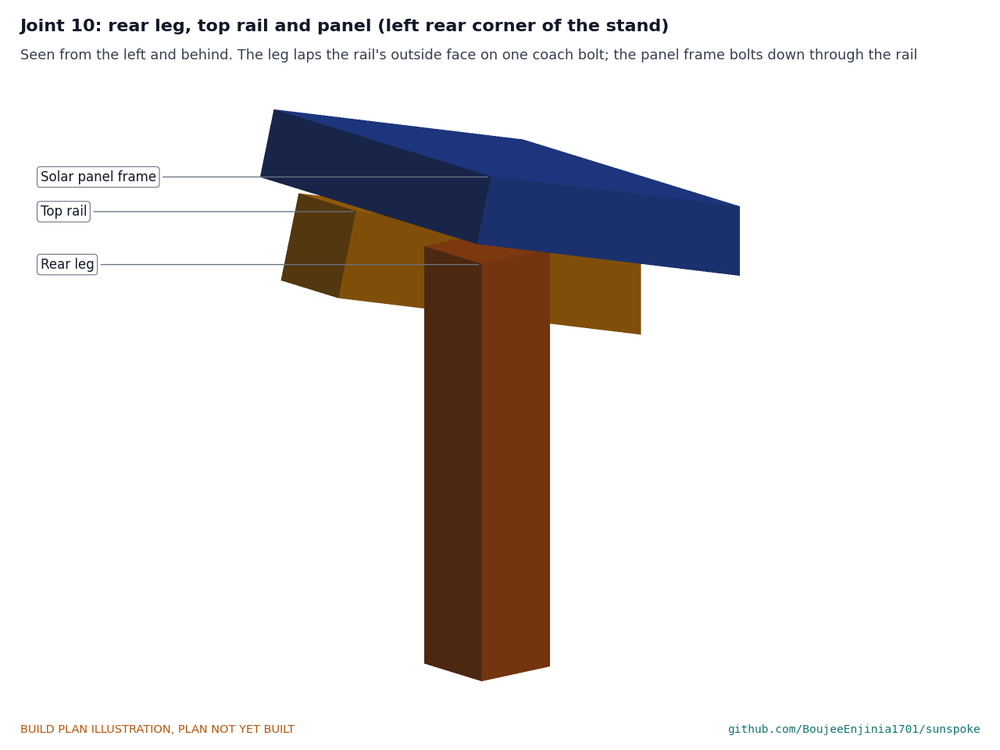

*Figure 21. The leg laps the outside face of the rail on one coach bolt; the panel's frame sits on the rail and bolts down through it.*

Each side frame is a rail and a brace, both inside two legs: one coach bolt where a leg meets the rail, two where it meets the brace, so the frame is a rigid quadrilateral. The rear legs are the tall ones, under the high edge of the panel. The battens join the two side frames across the back of the rear legs and the front of the front legs, 100 up.

**Check before moving on.** Each side frame lies flat and square; the two rails are the same length and drilled alike.

### 3.9 Bought components and what to do to them

Buy to specification, not brand. Line numbers are those of the bill of materials.

- **Motor wheel (line 1).** A 48 V, 250 W geared front hub motor, slow winding, 100 between its locknuts, 10 axle flats on an M12 axle long enough to leave three threads past the nut over a 6 dropout, a 5 arm and a washer; a built-in 10 kΩ winding thermistor. A 28 in (ETRTO 635) steel rim and 13G spokes. The mechanic laces the motor into the rim with a lacing card and fits the donor's tyre and tube.
- **Host adapter and charge inlet (line 5).** As specified in the bill of materials; potted, with two threaded inserts on its base 40 apart, a keyed charge inlet on its left side and a lead to the receptacle.
- **SwapCell receptacle (line 4).** The SwapCell interface v0.3 vehicle receptacle, with its 10 kΩ 1 % INTERLOCK coding resistor and a four-hole flange (37 each side, 24 apart).
- **Hinge and draw latch (line 4).** A stainless butt hinge 60 x 40 open; a stainless over-centre draw latch with an adjustable hook, a keeper and a safety catch, rated 500 N working load or more.
- **Band clamps (lines 4 and 14).** Seven 12 stainless worm-drive band clamps: three for the cradle (about 45 to 60 range), two for the torque arms and two for the controller (each to suit).
- **Fixings (line 14).** Stainless M4 and M5 bolts with nyloc nuts and washers, M4 and M5 countersunk screws, 4 self-tapping screws for plastic, a 4 rubber pad 120 x 40, cable ties, spiral wrap and dielectric grease.

#### 3.9.1 Controller (line 3)

A sealed 48 V, 15 A sine-wave controller with pedal-assist, brake, power-lock, walk-assist and motor thermistor inputs; set by the supplier to a 20 km/h cut-off and a current derate from 110 °C winding temperature.

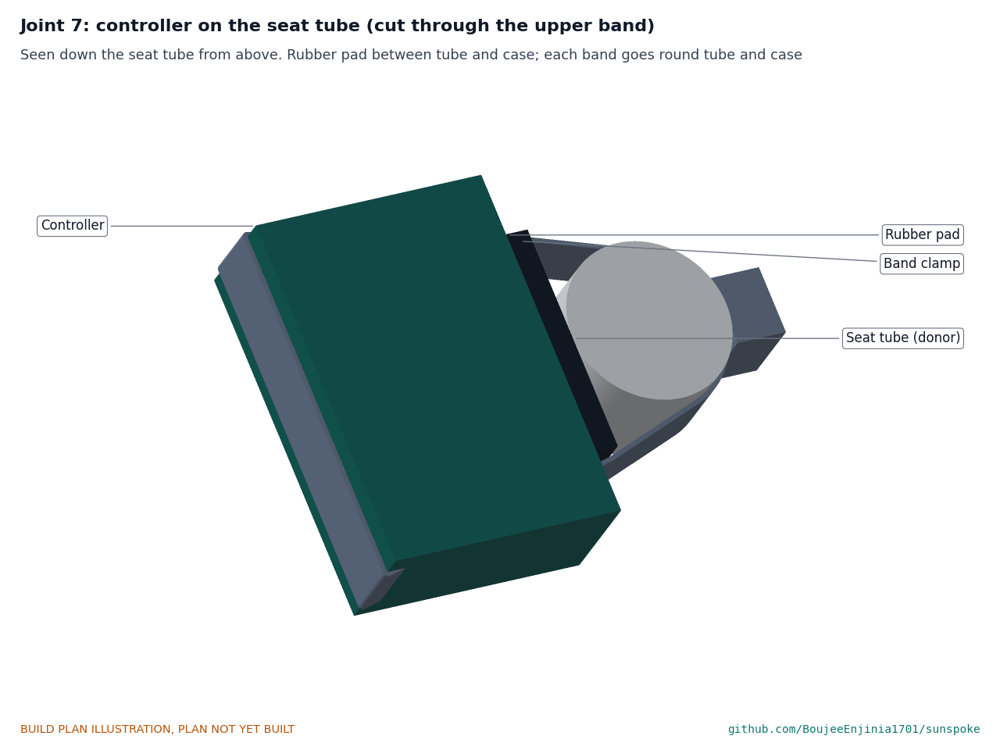

*Figure 22. Cut through the upper band, seen down the seat tube: the rubber pad sits between tube and case, and each band goes round both.*

It sits on the front of the seat tube, about a third of the way up, on the 4 rubber pad, cable glands facing down, held by two band clamps 90 apart.

#### 3.9.2 Pedal-assist sensor (line 7)

A split 12-magnet disc that clamps on the bottom bracket spindle, and a Hall sensor on a thin ring bracket.

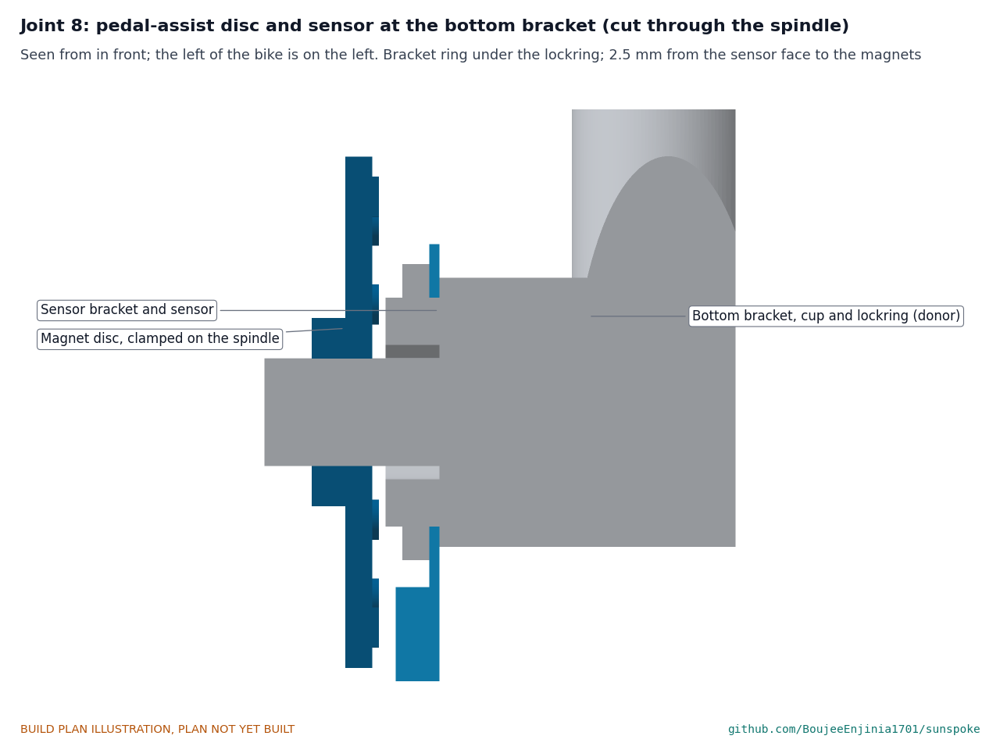

*Figure 23. Cut through the spindle: the bracket ring sits between the shell and the left lockring; the disc clamps on the spindle 10 outboard of the shell, its magnets 2.5 from the sensor face.*

Take off the left crank. Loosen the left lockring, slip the bracket ring under it with the sensor pointing down, and retighten the lockring while holding the cup still so the bearing adjustment does not change. Clamp the disc on the spindle with its magnets toward the sensor, set a 2 to 3 gap, and refit the crank.

#### 3.9.3 Display and brake sensors (line 8)

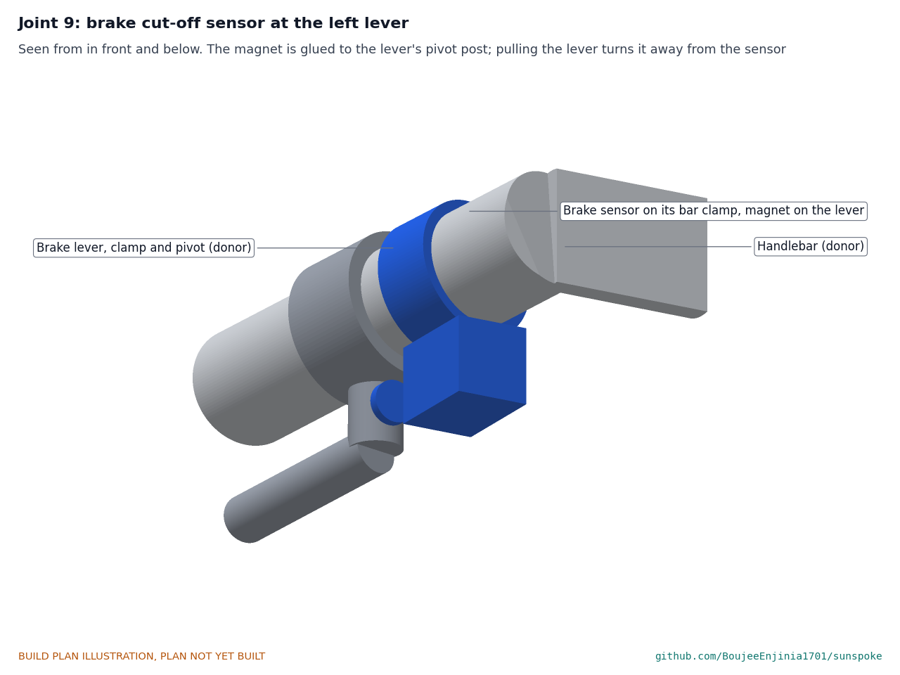

*Figure 24. The sensor clamps on the bar just inboard of the lever's own clamp; its magnet is glued to the lever's pivot post, about 6 from the sensor.*

The display clamps on the bar left of the stem. Each brake sensor clamps on the bar beside its lever; glue its magnet to the lever so that pulling the lever moves the magnet away from the sensor, and check the controller sees the change.

#### 3.9.4 Harness and wiring (line 9)

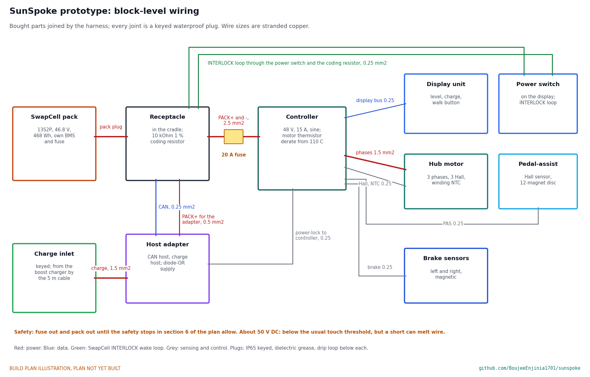

*Figure 25. Block-level wiring with wire sizes. Every joint is a keyed waterproof plug; no circuit board is laid out at this stage.*

Buy the harness made up to Figure 25, with keyed IP65 plugs, the 20 A fuse in a sealed holder on the pack lead, and spiral wrap. Route it as step 11 shows: from the adapter down the left side of the down tube to the bottom bracket, up the seat tube past the controller, along the left side of the top tube, down the head tube and the front of the left fork blade to the motor's axle, and up the stem to the display and brake sensors. Tie it every 150 and leave a drip loop below every plug.

#### 3.9.5 Solar set (lines 10 to 13)

- **Panel (line 10).** 100 W monocrystalline, about 1,000 x 670 x 35, aluminium frame with mounting holes on its long sides, maximum power voltage about 18 V, with its lead.
- **Charger (line 11).** Boost charger, 15 to 25 V in, constant current and constant voltage to 54.6 V at up to 2 A out, input-voltage tracking, weather-protected case with two mounting ears.
- **Charge cable (line 13).** 5 m of 2-core 1.5 mm² outdoor cable with a keyed plug that fits the host adapter's charge inlet.

## 4. Putting it together

In each picture the parts already fitted are grey and the part being fitted is in colour, with an arrow showing the way it goes in. Steps 1 to 4 are on the bench; steps 5 to 12 on the bike; steps 13 to 15 build the solar set.

### Step 1: V-saddles onto the tray

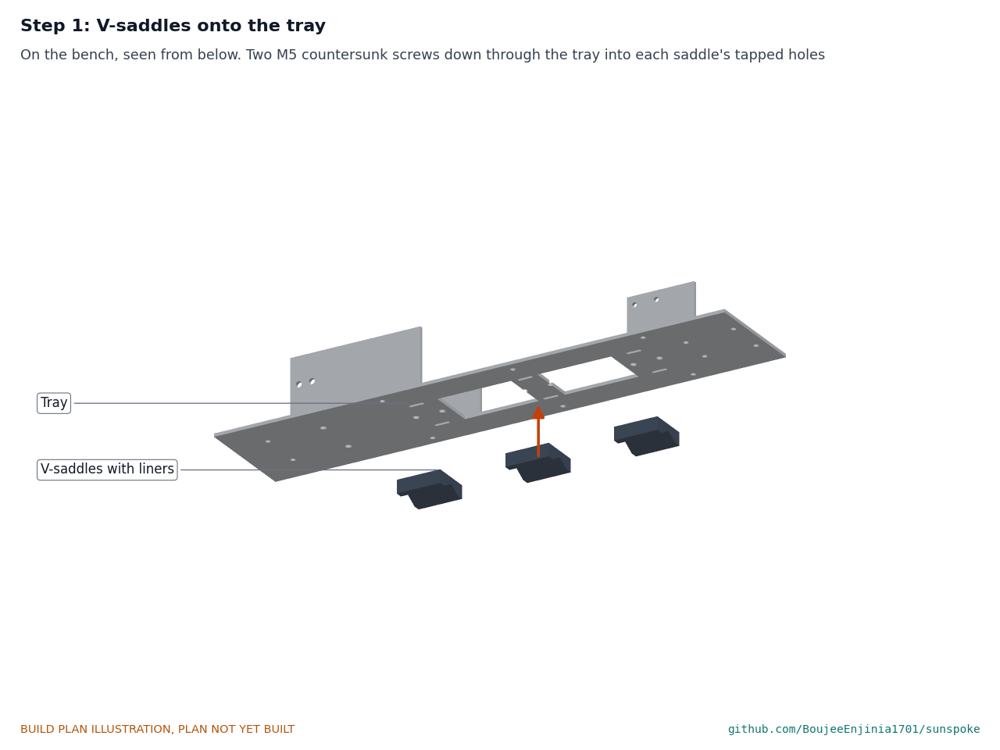

Two M5 countersunk screws down through the tray into each saddle, V downward, saddles centred under the three slot pairs.

### Step 2: slide strips, catch bar, end stop and receptacle

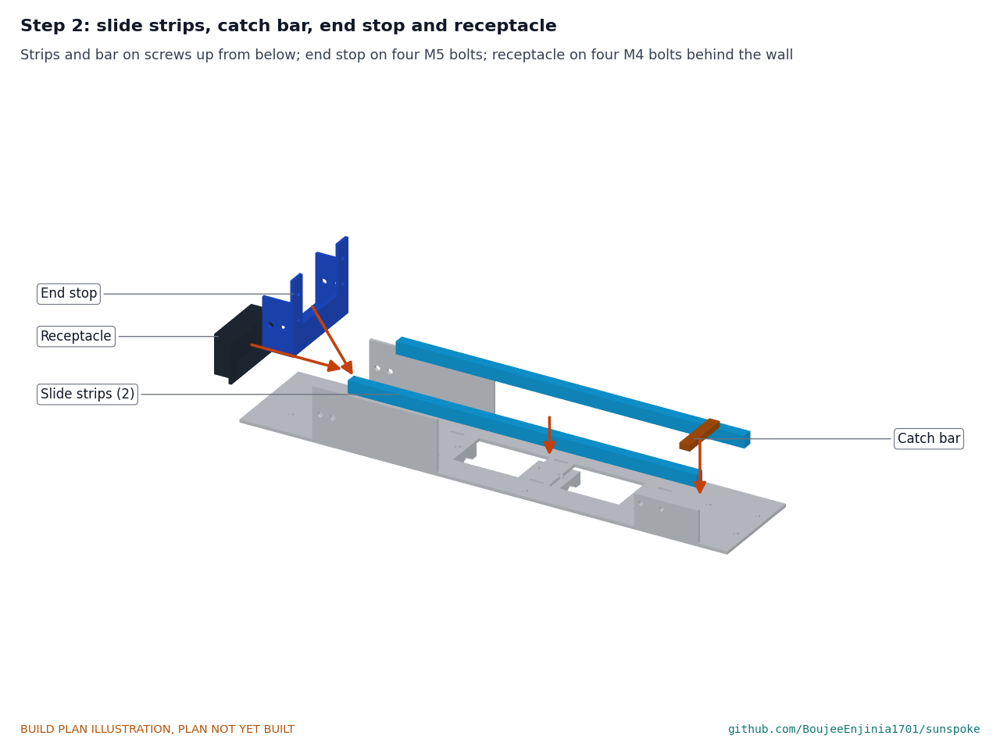

Strips on three plastic screws each and the catch bar on two M4 countersunk screws, all up from below. End stop between the guides on four M5 bolts in its flanges and two in its foot, nyloc nuts. Receptacle behind the wall on four M4 bolts.

### Step 3: gate, hinge and draw latch

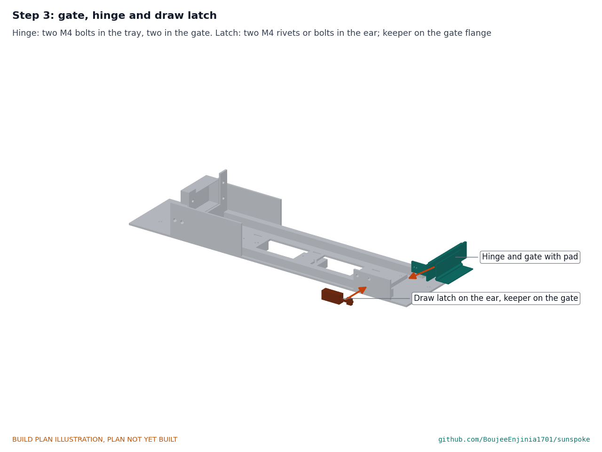

Hinge to the tray and the gate on M4 bolts with nyloc nuts. Latch on the outside of the ear, its hook toward the gate, on two M4 rivets or bolts. Check the gate folds flat and closes.

### Step 4: host adapter and its lead

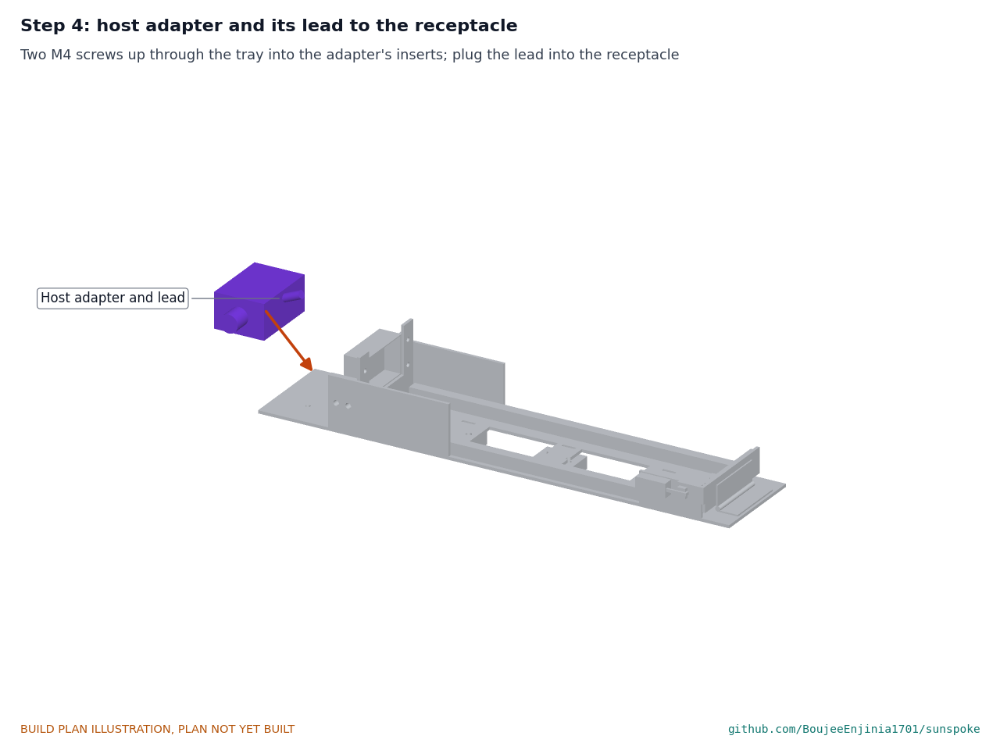

Two M4 screws up through the tray into the adapter's inserts. Plug its lead into the receptacle and tie it to the end stop.

### Step 5: cradle onto the down tube

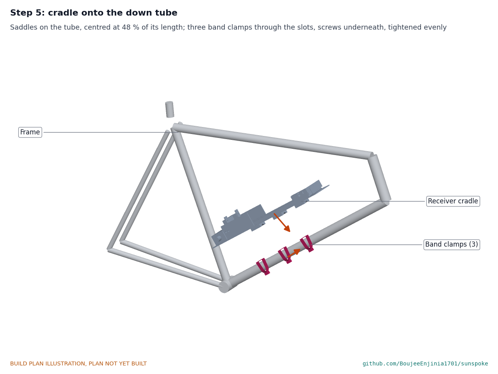

Mark a point 48 % of the way up the down tube from the bottom bracket (346 on a 721 tube). Set the cradle on the tube, middle saddle on the mark, guides toward the bottom bracket, ear on the left. Thread each band down through its slots and round the tube, screw underneath. Tighten the three bands evenly to the clamp maker's torque (typically 3 to 4 N·m) and record it. **Hold point:** the cradle does not turn on the tube when pushed hard by hand at the end stop.

### Step 6: motor wheel and torque arms into the fork

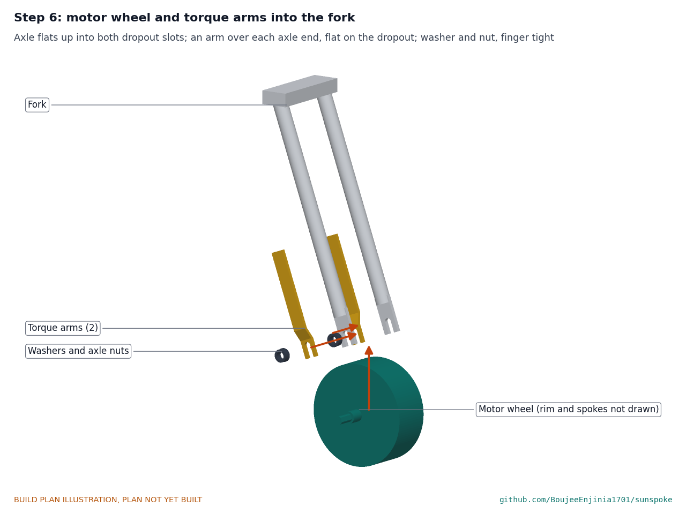

With the bike on a stand, lower the fork over the motor wheel so the axle flats slide up both dropout slots, cable on the left. Slip a torque arm over each axle end, slotted end flat on the dropout, long end up the outside of the blade. Washer and nut on each side, finger tight.

### Step 7: torque arm band clamps, then the axle nuts

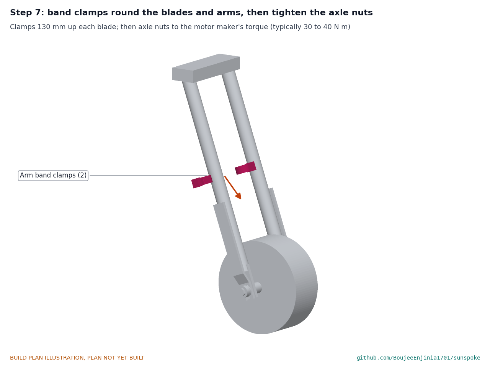

A band clamp round each blade and arm, 130 up from the axle, snug. Centre the wheel in the fork, then tighten the axle nuts to the motor maker's torque (typically 30 to 40 N·m) and the arm clamps to the clamp maker's torque. **Hold point:** safety stop S2.

### Step 8: controller onto the seat tube

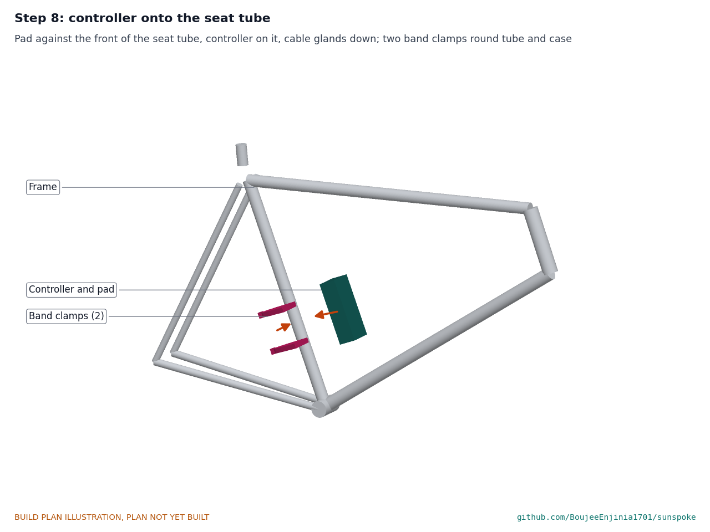

Rubber pad on the front of the seat tube, controller on it, glands down; two band clamps round tube and case.

### Step 9: pedal-assist sensor and disc

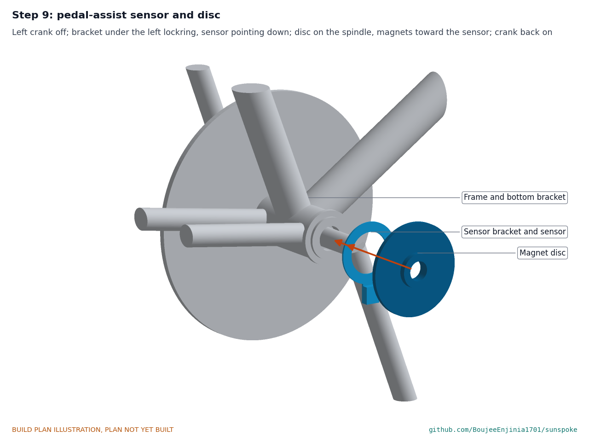

Left crank off; bracket under the left lockring, sensor pointing down; lockring tight with the cup held; disc on the spindle with a 2 to 3 gap to the sensor; crank back on and tight.

### Step 10: display and brake sensors

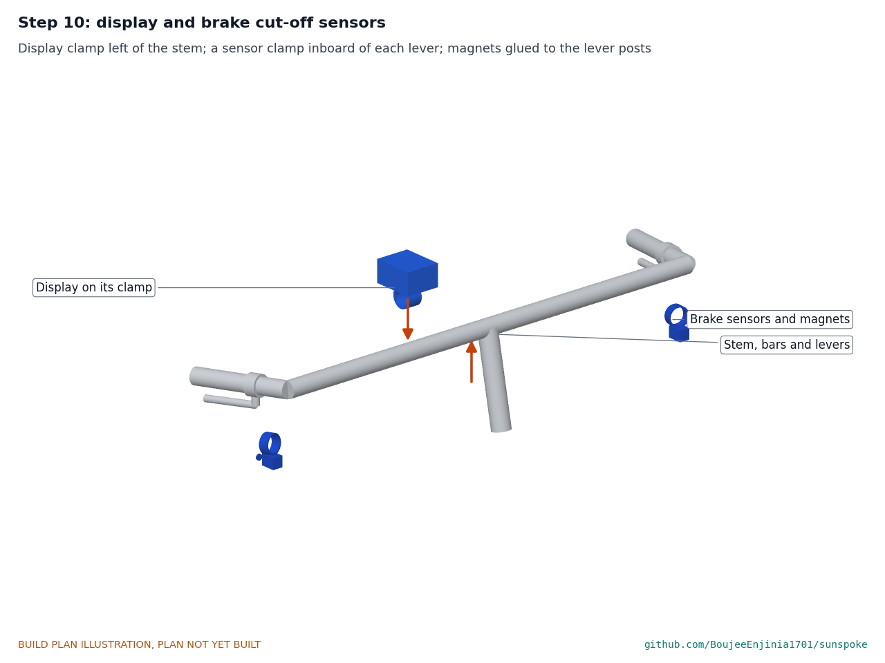

Display left of the stem, angled so the rider can read it. A sensor beside each lever, magnet glued on the lever.

### Step 11: harness

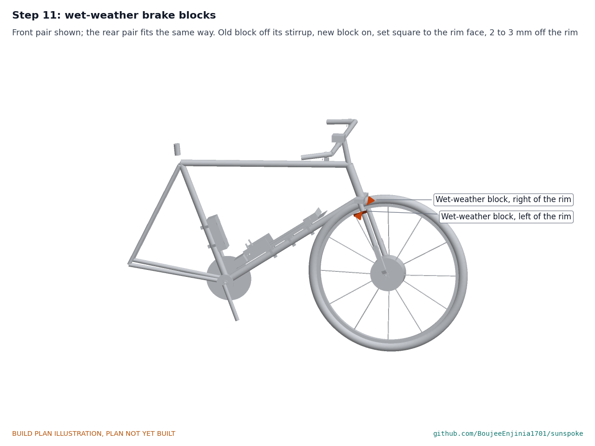

Route the harness as section 3.9.4 says, plug every joint with dielectric grease, and tie it every 150. Leave the fuse out. **Hold point:** safety stop S3.

### Step 12: pack in, gate up, latch closed

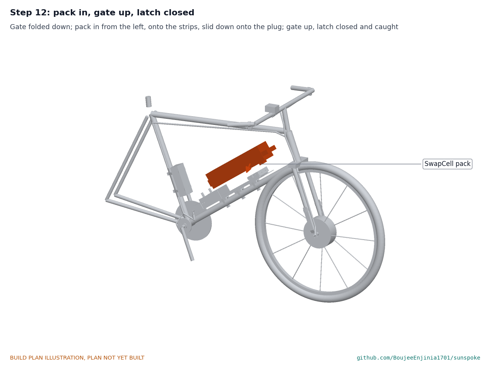

Only at safety stop S4. Fold the gate down. Hold the pack by its handle, set it on the strips from the left about 145 up from the end stop, and slide it down onto the plug until it seats on the wall and its latch drops behind the catch bar. Raise the gate, close the draw latch over centre and flip its safety catch. To take the pack out: catch off, latch open, gate down, press the pack's latch release, slide it 145 up the tube by its handle, lift it 45 off the strips and take it out to the left.

### Step 13: the stand's two side frames

Each side: a top rail and a low brace inside two legs, the tall rear leg under the high end. One coach bolt at each rail lap and two at each brace lap, washers and nuts on the inside.

### Step 14: battens, then the panel

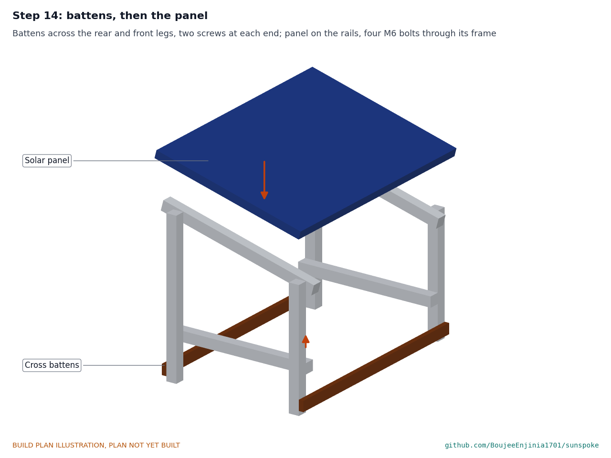

Stand the side frames 935 apart outside and screw the battens across the back of the rear legs and the front of the front legs. Lay the panel on the rails, glass up, and bolt it down through its frame holes with four M6 bolts, washers and nuts.

### Step 15: charger and panel lead

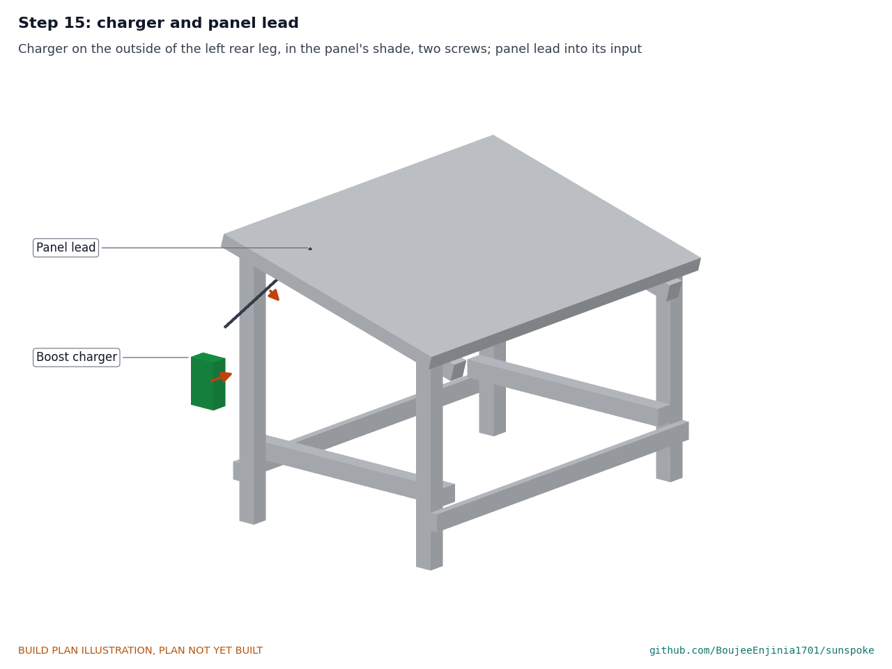

Screw the charger to the outside of the left rear leg, in the panel's shade. Plug the panel lead into its input and tie it to the rail. The 5 m charge cable runs from the charger to the bike's charge inlet only at safety stop S6.

## 5. First checks

These are the checks a TRL 4 test report would record; this plan only lists them. Requirement numbers are those of SSP-REQ-001.

*Table 2. First checks.*

| Check | Requirement | How | Pass when |
| --- | --- | --- | --- |
| No work on the donor | R4 | Look over the frame and fork after fitting | No weld, hole, cut or filing on frame or fork |
| Fitting time | R4 | Time a trained mechanic fitting a second kit with the parts made | 90 min or less |
| Fit to the donor | R5 | Saddles, dropouts, bottom bracket and levers as section 1 | Every part seats as its joint picture shows |
| Cradle grip | R13 | Push hard by hand at the end stop and sideways at the top end | No movement of the cradle on the tube |
| Pack seating and preload | R13 | Seat the pack and close the latch; pull the gate open at the pad with a spring balance | Latch goes over centre with 50 N or less at its lever; the gate does not lift off the pack below 330 N; safety catch engages |
| Pack swap | R13 | Take the pack out and put it back as step 12 | No tools needed and nothing catches; time recorded |
| Torque arms | R10 | Check both arms are keyed and clamped; wheel turns freely | No shake on the flats; clamps at torque |
| Fuse and wiring | R9, R10 | Pack out, fuse out: meter every plug to frame | Open circuit to the frame everywhere |
| Wake and power switch | R10, R13 | Pack in, fuse in, switch on and off | The pack wakes with the switch on and its output opens with it off |
| Brake cut-off | R10 | Wheel off the ground, gentle assist, pull each brake lever | Motor stops within 0.5 s on either lever |
| Assist settings | R1 | Read the controller settings | 20 km/h cut-off, walk assist 6 km/h, no throttle |
| Charging | R8, R13 | Panel in sun, charge cable to the inlet, bike off then on | Charger output flows into the pack; mode 3 with the bike off, mode 4 with it on |
| Mass | R6 | Weigh the bike before and after, with the pack | 7 kg or less added (6.78 kg estimated) |
| Stand | | Push on the panel corners by hand | Nothing moves at any joint |

## 6. Safety stops

Stop at each point. Carry on only when everything listed is true.

- **S1. Before the pack comes near the workshop.** It is a SwapCell pack from that project, undamaged, not swollen and never submerged, at a storage charge. A charging place is ready on a non-combustible surface, in shade and away from sleeping areas, with a fire extinguisher for electrical fires and a sand bucket within reach.
- **S2. Before the bike is ridden or the motor turned under power (after step 7).** Both torque arms keyed on the flats and clamped; axle nuts at the motor maker's torque; the fork and dropouts uncracked and unfiled.
- **S3. Before the fuse goes in (after step 11).** Pack out. Every plug fully home and greased; no cable crossing a moving part (wheel, cranks, steering lock to lock); every lead meters open to the frame; the fuse is 20 A.
- **S4. Before the pack goes in (step 12).** Fuse in; power switch off; brake sensors and their magnets fitted; the wheel off the ground or the bike on a stand.
- **S5. Before any powered test.** Gate closed with the latch over centre and its safety catch on; cradle bands at torque; the bike on a stand with the front wheel clear of the ground; brakes adjusted with new blocks.
- **S6. Before any charging.** The charging place of S1; the charger's output set and measured at 54.6 V or less with nothing connected; the panel lead and charge cable polarity checked with a meter; never charge a pack that is hot, damaged or below 0 °C; attended throughout the first charge.
- **S7. Before anyone rides it (outside this plan).** First rides are TRL 4 tests on a closed, dry site, at walking pace first, by a rider with a helmet, after the brake cut-off and stopping checks pass. Rod brakes on steel rims stop poorly in the wet: no wet riding.

## 7. Tools, skills and workspace

**Tools.** Hacksaw with a 24 teeth per inch blade; jigsaw with metal and wood blades; aviation snips; bench vice with soft jaws and two lengths of steel angle for folding; bench drill or a drill in a stand; drills 3 to 9 mm; countersink; M4 and M5 taps and tap drills; flat and half-round files; deburring tool; scriber, square, protractor, steel rule and calipers; a 10 mm gauge (or a 10 mm drill shank); screwdrivers and a nut driver for band clamps; spanners to 19 mm and hex keys; torque wrench to 40 N·m and a torque screwdriver to 6 N·m; crank puller and bottom bracket lockring spanner; spoke key and a truing stand or the fork itself; wood saw, 9 mm wood drill, socket for coach bolts; multimeter; contact adhesive; scale to 50 kg (weigh the bike in a sling); stopwatch.

**Skills.** A trained bicycle mechanic for the wheel build, bottom bracket, brakes and fitting; basic metalwork (marking out, sawing, drilling, tapping, folding sheet) for the cradle and torque arms; basic carpentry for the stand. Plug-together wiring only: no soldering on the bike. Care with lithium-ion packs as section 6 says.

**Workspace.** A bench about 1.5 x 0.6 m with a vice; a bike stand; a metalwork corner kept apart from the electrics so chips stay off the plugs; an outdoor spot for the solar set; the charging place of S1.

**Personal protective equipment.** Safety glasses for cutting, drilling and folding; cut-resistant gloves for sheet and bar; hearing protection when sawing; no gloves near a turning drill.

## 8. Where the numbers come from

- Model and constructability checks: `cad/src/model.py` (`python cad/src/model.py --check`, 57 checks); STEP and STL exports in `cad/step/` and `cad/stl/`.
- Pictures: `cad/src/build_plan_media.py`, using `.kit/build_views.py`; written to `docs/05-build-plan/` and `cad/drawings/SSP-DWG-101` to `SSP-DWG-110`.
- General arrangement: `cad/drawings/SSP-DWG-001.pdf`, Rev P3.
- Calculations: `docs/04-calcs/01-sizing.md` (SSP-CAL-001 v0.3) and `docs/04-calcs/sizing.py`; mass (section 2), torque arms (section 7), cradle retention, gate and end stop (section 8), fit and removal path (section 9).
- Bill of materials: `bom/bom.csv`.
- Decisions: `docs/decisions/0003-design-for-construction.md` (SSP-DDR-003), with SSP-DDR-001 and SSP-DDR-002; open items in `docs/06-design-decisions.md` (SSP-DEC-001).
- Requirements: `docs/03-requirements.md` (SSP-REQ-001 v0.5).
